# AUDIT-UI — فحص الواجهة كما يراه المستخدم

فحص آلي بمتصفح حقيقي. **204 زيارة** = 17 مسار × 3 نافذة × 2 ثيم × 2 لغة، إضافة إلى مرور تفاعلي فوق كل زر ورابط. المدة 1434ث.

**مصدر المسارات:** `src/lib/nav.ts` (`INDEXABLE_ROUTES`) — لا `sitemap.xml`. الـ sitemap يستبعد `/account` عمداً ويُسقط مسارات Firebase الثلاثة حين لا تكون مهيّأة (القاعدة D66)، فقراءة منه كانت ستُسقط `/enter` و`/tracker` و`/journal` من الفحص — وهي بالضبط الصفحات التي تعرض حالتها المتدهورة الآن. هذا الفحص يجيب «ما الذي يصل إليه مستخدم؟»، لا «ماذا نريد لمحرك بحث أن يراه؟».

## الخلاصة

| | العدد |
|---|---|
| **P0** | 0 |
| **P1** | 8 |
| **P2** | 59 |
| **P3** | 0 |

زيارات ناجحة **192/204** · زيارات فيها خطأ طرفية **0** · زيارات فيها طلب فاشل **0** · زيارات فيها تمرير أفقي **0** · مخالفات axe **1 نوع

الضغط التفاعلي: **649 ضغطة** على أزرار وروابط وحوافز. و**30 عنصراً** لم يُضغط لأنه لا يوجد إلا داخل قائمة مطويّة على حالة تحميل نظيفة — وهذا رقم مُعلن لا مُخفى، حتى لا يُقرأ التقرير كتغطية كاملة وهو ليس كذلك.

## التغطية — كل مسار في 12 تركيبة

| المسار | 360 داكن/ع | 360 فاتح/ع | 360 داكن/en | 360 فاتح/en | 768 داكن/ع | 768 فاتح/en | 1440 داكن/ع | 1440 فاتح/en | الحالة |
|---|---|---|---|---|---|---|---|---|---|
| `/` | ✓ | ✓ | ✓ | ✓ | ✓ | ✓ | ✓ | ✓ | طبيعي |
| `/enter` | ✓ | ✓ | ✓ | ✓ | ✓ | ✓ | ✓ | ✓ | طبيعي |
| `/wisdom` | ✓ | ✓ | ✓ | ✓ | ✓ | ✓ | ✓ | ✓ | طبيعي |
| `/dialogue` | ✓ | ✓ | ✓ | ✓ | ✓ | ✓ | ✓ | ✓ | طبيعي |
| `/journal` | ✓ | ✓ | ✓ | ✓ | ✓ | ✓ | ✓ | ✓ | طبيعي |
| `/tracker` | ✓ | ✓ | ✓ | ✓ | ✓ | ✓ | ✓ | ✓ | طبيعي |
| `/paths` | ✓ | ✓ | ✓ | ✓ | ✓ | ✓ | ✓ | ✓ | طبيعي |
| `/quotes` | ✓ | ✓ | ✓ | ✓ | ✓ | ✓ | ✓ | ✓ | طبيعي |
| `/pricing` | ✓ | ✓ | ✓ | ✓ | ✓ | ✓ | ✓ | ✓ | طبيعي |
| `/privacy` | ✓ | ✓ | ✓ | ✓ | ✓ | ✓ | ✓ | ✓ | طبيعي |
| `/terms` | ✓ | ✓ | ✓ | ✓ | ✓ | ✓ | ✓ | ✓ | طبيعي |
| `/refund` | ✓ | ✓ | ✓ | ✓ | ✓ | ✓ | ✓ | ✓ | طبيعي |
| `/oracle` | ✓ | ✓ | ✓ | ✓ | ✓ | ✓ | ✓ | ✓ | طبيعي |
| `/sanctum` | ✓ | ✓ | ✓ | ✓ | ✓ | ✓ | ✓ | ✓ | طبيعي |
| `/account` | ✓ | ✓ | ✓ | ✓ | ✓ | ✓ | ✓ | ✓ | طبيعي |
| `/god-mode-admin` | ✓ كما هو متوقّع | ✓ كما هو متوقّع | ✓ كما هو متوقّع | ✓ كما هو متوقّع | ✓ كما هو متوقّع | ✓ كما هو متوقّع | ✓ كما هو متوقّع | ✓ كما هو متوقّع | طبيعي |
| `/membership` | ✗ 200 | ✗ 200 | ✗ 200 | ✗ 200 | ✗ 200 | ✗ 200 | ✗ 200 | ✗ 200 | طبيعي |

`✓` صفحة كاملة · `⚠` تعمل لكن بخطأ في الطرفية · `✗` عطل · `✓ كما هو متوقّع` = المسار يردّ بالحالة التي وُصف بها في خريطة المسارات (مثل `/god-mode-admin` الذي يرجع 404 عمداً لأنه محجوب) · «بلا Firebase» = الصفحة تعرض شاشة «غير متاح» لأن مفاتيح التهيئة غير موجودة.

## العيوب مرتّبة بالأولوية

### P1 — 8 عيباً

| المسار | النافذة | الوصف | الدليل | لقطة | عدد التركيبات |
|---|---|---|---|---|---|
| `/wisdom` | mobile-360 | تباين نص غير كافٍ | 1.48:1 (المطلوب 4.5:1) - "Rumi" 10px/700 rgb(107, 97, 82) على rgb(127, 125, 119) | ![contrast:span.display-latin.text-[10px]:1.48](docs/audit/screenshots/_wisdom__mobile-360__light__ar.png) | 42 |
| `/wisdom` | mobile-360 | تباين نص غير كافٍ | 1.48:1 (المطلوب 4.5:1) - "صاحب القلب · 1207–1273" 11.2px/400 rgb(107, 97, 82) على rgb(127, 125, 119) | ![contrast:span.mt-1.5.text-[0.7rem]:1.48](docs/audit/screenshots/_wisdom__mobile-360__light__ar.png) | 42 |
| `/wisdom` | mobile-360 | تباين نص غير كافٍ | 2.03:1 (المطلوب 4.5:1) - "أن يرى المعنى وهو يتحرك" 12.8px/400 rgba(69, 61, 49, 0.75) على rgb(127, 125, 119) | 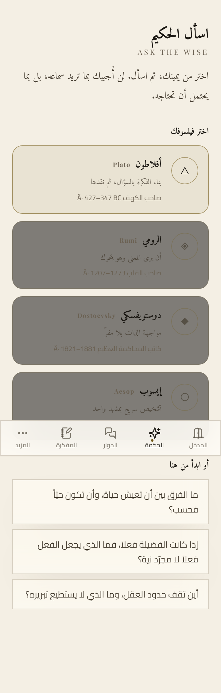 | 42 |
| `/` | mobile-360 | تباين نص غير كافٍ | 1.95:1 (المطلوب 3:1) - "ع" 36px/700 rgb(26, 23, 18) على rgb(73, 72, 68) | 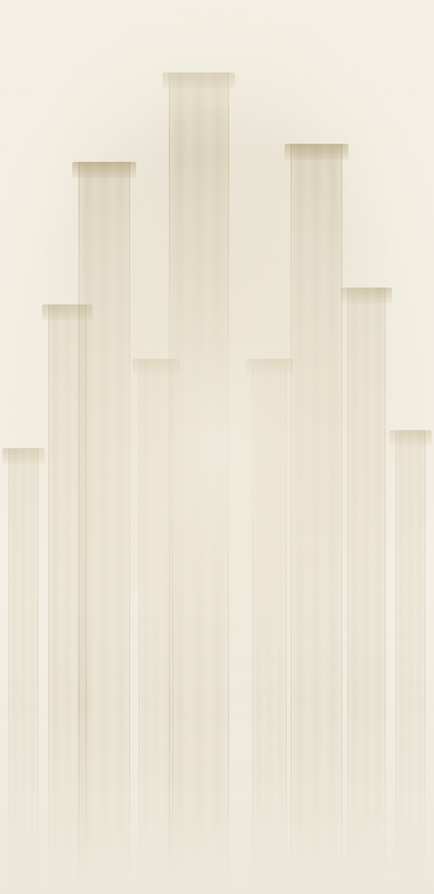 | 6 |
| `/enter` | mobile-360 | «نسيت كلمة المرور؟» لا يستجيب | locator.click: Timeout 4000ms exceeded. — العنصر موجود في الصفحة لكن النقر لم يُنفَّذ | — | 2 |
| `/enter` | mobile-360 | «لديّ رمز استعادة» لا يستجيب | locator.click: Timeout 4000ms exceeded. — العنصر موجود في الصفحة لكن النقر لم يُنفَّذ | — | 2 |
| `/enter` | mobile-360 | «العضويات» لا يستجيب | locator.click: Timeout 4000ms exceeded. — العنصر موجود في الصفحة لكن النقر لم يُنفَّذ | — | 1 |
| `/paths` | mobile-360 | «مقارنة تفصيلية بين المستويات» لا يستجيب | locator.click: Timeout 4000ms exceeded. — العنصر موجود في الصفحة لكن النقر لم يُنفَّذ | — | 1 |

### P2 — 59 عيباً

| المسار | النافذة | الوصف | الدليل | لقطة | عدد التركيبات |
|---|---|---|---|---|---|
| `/pricing` | mobile-360 | تباين نص غير كافٍ | 3.32:1 (المطلوب 4.5:1) - "5 حوارات فقط مع الحكيم" 14px/400 rgba(69, 61, 49, 0.6) على rgb(251, 248, 240) | 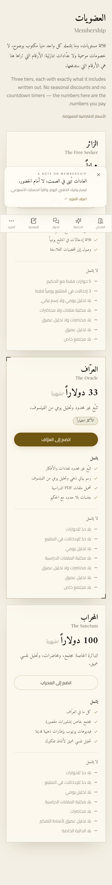 | 252 |
| `/privacy` | mobile-360 | تباين نص غير كافٍ | 3.64:1 (المطلوب 4.5:1) - "Mind in a Box is an AI-assisted philosophical reflection app" 14px/400 rgba(69, 61, 49, 0.65) على rgb(244, 239, 228) |  | 206 |
| `/enter` | mobile-360 | هدف لمس أصغر من اللازم | a.mt-3.inline-flex is 73×16 ("اعرف المزيد
↗") | — | 168 |
| `/journal` | mobile-360 | تباين نص غير كافٍ | 3.32:1 (المطلوب 4.5:1) - "1" 12px/400 rgba(69, 61, 49, 0.6) على rgb(251, 248, 240) | 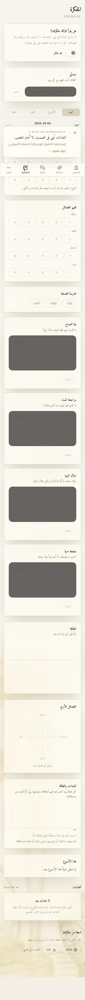 | 134 |
| `/quotes` | mobile-360 | هدف لمس أصغر من اللازم | a.display-arabic.text-[0.7rem] is 85×21 ("بلا علامة مائية للعضوية") | — | 132 |
| `/privacy` | mobile-360 | تباين نص غير كافٍ | 3.64:1 (المطلوب 4.5:1) - "Summary" 14px/400 rgba(69, 61, 49, 0.65) على rgb(244, 239, 228) |  | 116 |
| `/enter` | mobile-360 | تباين نص غير كافٍ | 4.35:1 (المطلوب 4.5:1) - "الحكمة" 10px/400 rgba(69, 61, 49, 0.7) على rgb(253, 251, 244) | ![contrast:span.text-[10px].leading-tight:4.35](docs/audit/screenshots/_enter__mobile-360__light__ar.png) | 78 |
| `/privacy` | mobile-360 | تباين نص غير كافٍ | 3.22:1 (المطلوب 4.5:1) - "Account: a Firebase anonymous identifier, your email address" 14px/400 rgba(69, 61, 49, 0.6) على rgb(244, 239, 228) |  | 72 |
| `/enter` | tablet-768 | تباين نص غير كافٍ | 3.02:1 (المطلوب 4.5:1) - "ع" 18px/700 rgb(26, 23, 18) على rgb(101, 100, 98) | 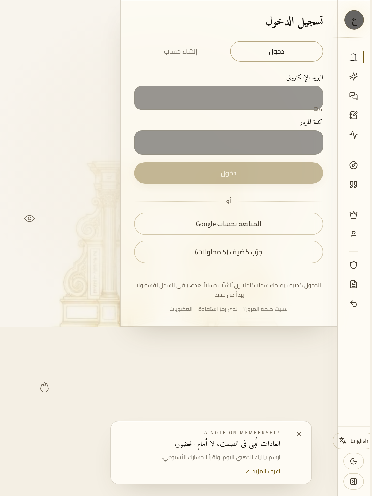 | 60 |
| `/quotes` | mobile-360 | تباين نص غير كافٍ | 3.32:1 (المطلوب 4.5:1) - "Apology, 117a" 12px/400 rgba(69, 61, 49, 0.6) على rgb(251, 248, 240) | 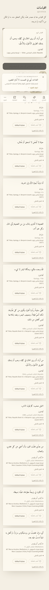 | 60 |
| `/enter` | mobile-360 | مخالفة axe: Elements must meet minimum color contrast ratio thresholds | color-contrast (serious) على 4 عنصر — a[data-audit-focus="2"] > .text-\[10px\].leading-tight — "الحكمة" Fix any of the following: Element has insufficient color contrast of 4.34 (foreground color: #7c766c, background color: #fdfbf4, font size: 7.5pt (10px), font weight: normal). Expected contrast ratio of 4.5:1 · a[data-audit-focus="3"] > .text-\[10px\].leading-tight — "الحوار" Fix any of the following: Element has insufficient color contrast of 4.34 (foreground color: #7c766c, background color: #fdfbf4, font size: 7.5pt (10px), font weight: normal). Expected contrast ratio of 4.5:1 · a[data-audit-focus="4"] > .text-\[10px\].leading-tight — "المفكرة" Fix any of the following: Element has insufficient color contrast of 4.34 (foreground color: #7c766c, background color: #fdfbf4, font size: 7.5pt (10px), font weight: normal). Expected contrast ratio of 4.5:1 | 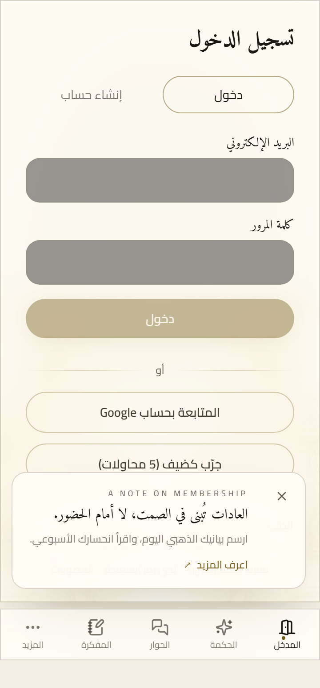 | 58 |
| `/quotes` | mobile-360 | تباين نص غير كافٍ | 3.32:1 (المطلوب 4.5:1) - "أضف للمفضّلة" 12px/400 rgba(69, 61, 49, 0.6) على rgb(251, 248, 240) |  | 56 |
| `/quotes` | mobile-360 | هدف لمس أصغر من اللازم | summary.cursor-pointer.text-[0.7rem] is 278×17 ("النص الأصلي") | — | 44 |
| `/quotes` | tablet-768 | هدف لمس أصغر من اللازم | summary.cursor-pointer.text-[0.7rem] is 614×17 ("النص الأصلي") | — | 44 |
| `/quotes` | desktop-1440 | هدف لمس أصغر من اللازم | summary.cursor-pointer.text-[0.7rem] is 686×17 ("النص الأصلي") | — | 44 |
| `/wisdom` | mobile-360 | تباين نص غير كافٍ | 4.34:1 (المطلوب 4.5:1) - "الروميRumi" 15.68px/700 rgb(26, 23, 18) على rgb(127, 125, 119) |  | 42 |
| `/enter` | mobile-360 | تباين نص غير كافٍ | 4.35:1 (المطلوب 4.5:1) - "ارسم بيانيك الذهبي اليوم، واقرأ انحسارك الأسبوعي." 12px/400 rgba(69, 61, 49, 0.7) على rgb(253, 251, 244) |  | 40 |
| `/pricing` | mobile-360 | تباين نص غير كافٍ | 3.32:1 (المطلوب 4.5:1) - "للأبد" 14px/400 rgba(69, 61, 49, 0.6) على rgb(251, 248, 240) |  | 36 |
| `/refund` | mobile-360 | تباين نص غير كافٍ | 4.12:1 (المطلوب 4.5:1) - "Principle" 14px/400 rgba(69, 61, 49, 0.7) على rgb(244, 239, 228) | 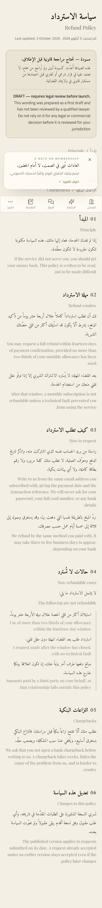 | 36 |
| `/paths` | mobile-360 | هدف لمس أصغر من اللازم | a.text-sm.text-gold-muted/70 is 114×20 ("العرّافThe Oracle") | — | 24 |
| `/paths` | mobile-360 | تباين نص غير كافٍ | 4.29:1 (المطلوب 4.5:1) - "العرّافThe Oracle" 14px/400 rgba(69, 61, 49, 0.7) على rgb(251, 248, 240) | 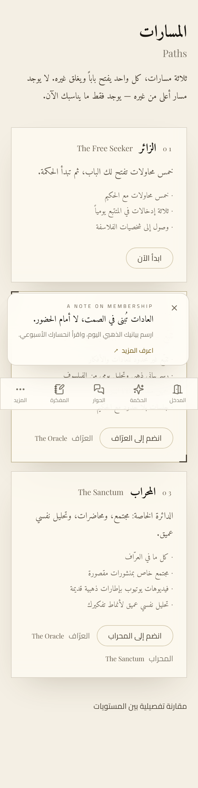 | 18 |
| `/account` | mobile-360 | تباين نص غير كافٍ | 4.29:1 (المطلوب 4.5:1) - "البريد الإلكتروني" 14px/400 rgba(69, 61, 49, 0.7) على rgb(251, 248, 240) | 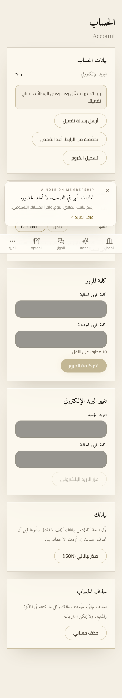 | 18 |
| `/paths` | mobile-360 | تباين نص غير كافٍ | 4.12:1 (المطلوب 4.5:1) - "Paths" 18px/400 rgba(69, 61, 49, 0.7) على rgb(244, 239, 228) |  | 16 |
| `/enter` | mobile-360 | هدف لمس أصغر من اللازم | button.text-gold-muted/70.underline-offset-4 is 92×16 ("نسيت كلمة المرور؟") | — | 12 |
| `/enter` | mobile-360 | هدف لمس أصغر من اللازم | button.text-gold-muted/70.underline-offset-4 is 81×16 ("لديّ رمز استعادة") | — | 12 |
| `/enter` | mobile-360 | هدف لمس أصغر من اللازم | a.text-gold-muted/70.underline-offset-4 is 48×16 ("العضويات") | — | 12 |
| `/enter` | mobile-360 | تباين نص غير كافٍ | 4.29:1 (المطلوب 4.5:1) - "نسيت كلمة المرور؟" 12px/400 rgba(69, 61, 49, 0.7) على rgb(251, 248, 240) |  | 12 |
| `/journal` | mobile-360 | هدف لمس أصغر من اللازم | button.display-arabic.items-center is 64×16 ("عادة جديدة") | — | 12 |
| `/paths` | mobile-360 | هدف لمس أصغر من اللازم | a.text-sm.text-gold-muted/70 is 131×20 ("المحرابThe Sanctum") | — | 12 |
| `/quotes` | mobile-360 | تباين نص غير كافٍ | 3.22:1 (المطلوب 4.5:1) - "سقراط 8" 12px/400 rgba(69, 61, 49, 0.6) على rgb(244, 239, 228) |  | 12 |
| `/quotes` | mobile-360 | تباين نص غير كافٍ | 3.22:1 (المطلوب 4.5:1) - "8" 12px/400 rgba(69, 61, 49, 0.6) على rgb(244, 239, 228) |  | 12 |
| `/oracle` | mobile-360 | تباين نص غير كافٍ | 3.64:1 (المطلوب 4.5:1) - "هذه المكتبة لأعضائها. سجّل الدخول بالحساب المرتبط باشتراكك." 14px/400 rgba(69, 61, 49, 0.65) على rgb(244, 239, 228) | 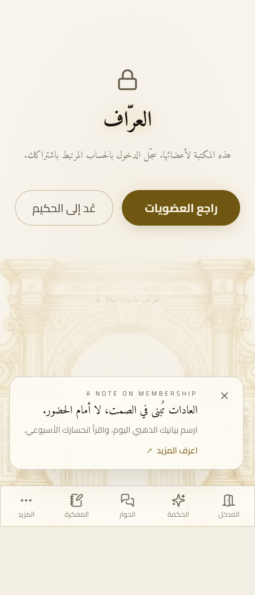 | 12 |
| `/account` | mobile-360 | تباين نص غير كافٍ | 4.29:1 (المطلوب 4.5:1) - "English" 12px/400 rgba(69, 61, 49, 0.7) على rgb(251, 248, 240) |  | 12 |
| `/enter` | mobile-360 | تباين نص غير كافٍ | 4.29:1 (المطلوب 4.5:1) - "إنشاء حساب" 14px/400 rgba(69, 61, 49, 0.7) على rgb(251, 248, 240) |  | 6 |
| `/enter` | mobile-360 | تباين نص غير كافٍ | 4.29:1 (المطلوب 4.5:1) - "العضويات" 12px/400 rgba(69, 61, 49, 0.7) على rgb(251, 248, 240) |  | 6 |
| `/wisdom` | mobile-360 | تباين نص غير كافٍ | 4.4:1 (المطلوب 4.5:1) - "بناء الفكرة بالسؤال، ثم نقدها" 12.8px/400 rgba(69, 61, 49, 0.75) على rgb(233, 227, 211) |  | 6 |
| `/journal` | mobile-360 | تباين نص غير كافٍ | 3.22:1 (المطلوب 4.5:1) - "ملف كامل بما كتبته، يُحفظ عندك. لا يُرسل إلى أي جهة." 12px/400 rgba(69, 61, 49, 0.6) على rgb(244, 239, 228) |  | 6 |
| `/journal` | mobile-360 | تباين نص غير كافٍ | 3.32:1 (المطلوب 4.5:1) - "لا. لا يقرأ الذكاء أي شيء كتبته هنا — لا نصّك، ولا مزاجك، ول" 12px/400 rgba(69, 61, 49, 0.6) على rgb(251, 248, 240) |  | 6 |
| `/tracker` | mobile-360 | تباين نص غير كافٍ | 3.22:1 (المطلوب 4.5:1) - "سجّل الدخول لتبدأ التتبّع. سجلّك يُحفظ في حسابك ويبقى متاحاً" 14px/400 rgba(69, 61, 49, 0.6) على rgb(244, 239, 228) | 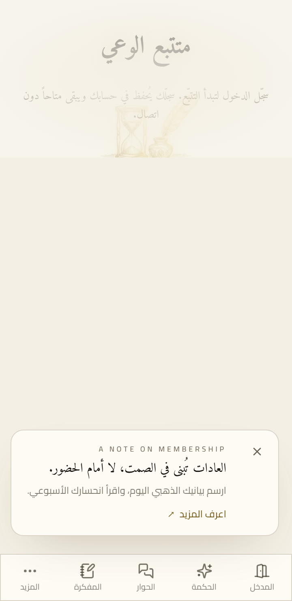 | 6 |
| `/quotes` | mobile-360 | تباين نص غير كافٍ | 3.22:1 (المطلوب 4.5:1) - "القالب:" 12px/400 rgba(69, 61, 49, 0.6) على rgb(244, 239, 228) |  | 6 |
| `/pricing` | tablet-768 | ازاحة تخطيط (CLS) | CLS 0.1953 على http://localhost:3000/pricing —_sources: 0.14 ← article.glass.flex-col, article.glass.flex-col, article.glass.flex-col, header.mb-10.max-w-2xl, li.items-start.gap-2 \| 0.039 ← unknown, unknown, section.mt-7, section.mt-6.border-t, unknown \| 0.016 ← section.mt-7, section.mt-6.border-t, section.mt-6.border-t, section.mt-6.border-t, a.mt-6.inline-flex |  | 2 |
| `/terms` | tablet-768 | ازاحة تخطيط (CLS) | CLS 0.1016 على http://localhost:3000/terms —_sources: 0.066 ← div.mx-auto.max-w-3xl, div.mb-4 \| 0.019 ← div.flex-col.gap-10, p.mt-4.border-t, unknown, unknown, li \| 0.016 ← nav[aria-label="أقسام هذه الوثيقة · Sections"], div.flex-col.gap-10, p.mt-4.border-t | 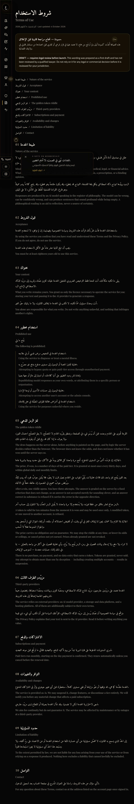 | 2 |
| `/membership` | tablet-768 | ازاحة تخطيط (CLS) | CLS 0.1993 على http://localhost:3000/pricing —_sources: 0.145 ← div.mx-auto.max-w-6xl, article.glass.flex-col, li.items-start.gap-2, li.items-start.gap-2, svg.lucide.lucide-minus \| 0.039 ← unknown, unknown, section.mt-7, section.mt-6.border-t, unknown \| 0.016 ← section.mt-7, section.mt-6.border-t, section.mt-6.border-t, section.mt-6.border-t, a.mt-6.inline-flex | 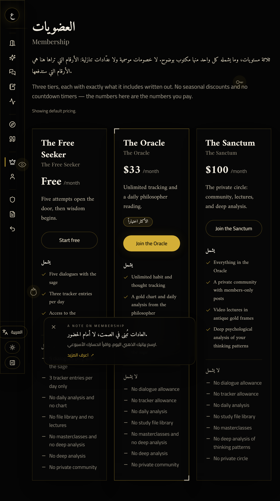 | 2 |
| `/paths` | tablet-768 | ازاحة تخطيط (CLS) | CLS 0.1102 على http://localhost:3000/paths —_sources: 0.056 ← article.glass.p-6, article.glass.p-6, article.glass.p-6, p.display-arabic.mt-4 \| 0.028 ← ol.flex-col.gap-4, article.glass.p-6, article.glass.p-6, article.glass.p-6, unknown \| 0.026 ← ol.flex-col.gap-4, article.glass.p-6, article.glass.p-6, article.glass.p-6 | 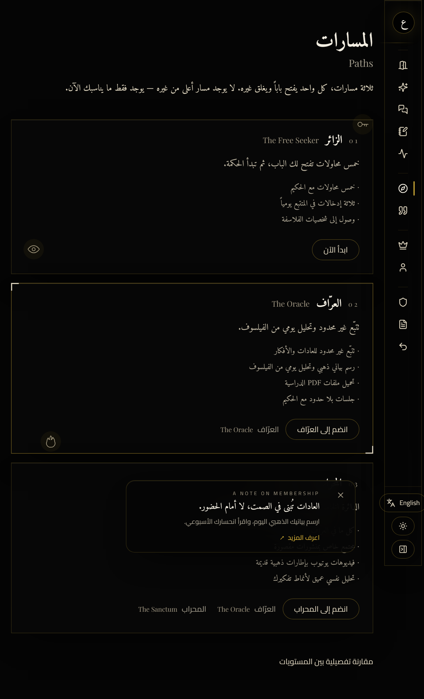 | 1 |
| `/pricing` | mobile-360 | ازاحة تخطيط (CLS) | CLS 0.1237 على http://localhost:3000/pricing —_sources: 0.067 ← article.glass.flex-col, p.mt-3.leading-relaxed, unknown, unknown, unknown \| 0.052 ← article.glass.flex-col, p.mt-3.leading-relaxed, p.mt-5.text-xs, section.mt-7 \| 0.005 ← a.mt-6.inline-flex, section.mt-7, span.text-sm.text-gold-muted/60, span.text-[10px].leading-tight, span.text-[10px].leading-tight | 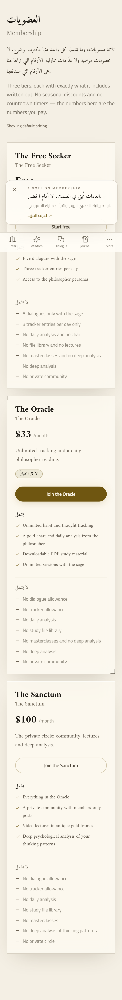 | 1 |
| `/pricing` | tablet-768 | ازاحة تخطيط (CLS) | CLS 0.2009 على http://localhost:3000/pricing —_sources: 0.145 ← div.mx-auto.max-w-6xl, article.glass.flex-col, li.items-start.gap-2, li.items-start.gap-2, svg.lucide.lucide-minus \| 0.04 ← unknown, unknown, section.mt-7, section.mt-6.border-t, unknown \| 0.016 ← section.mt-7, section.mt-6.border-t, section.mt-6.border-t, section.mt-6.border-t, a.mt-6.inline-flex |  | 1 |
| `/pricing` | tablet-768 | ازاحة تخطيط (CLS) | CLS 0.1997 على http://localhost:3000/pricing —_sources: 0.145 ← div.mx-auto.max-w-6xl, article.glass.flex-col, li.items-start.gap-2, li.items-start.gap-2, svg.lucide.lucide-minus \| 0.039 ← unknown, unknown, section.mt-7, section.mt-6.border-t, unknown \| 0.016 ← section.mt-7, section.mt-6.border-t, section.mt-6.border-t, section.mt-6.border-t, a.mt-6.inline-flex | 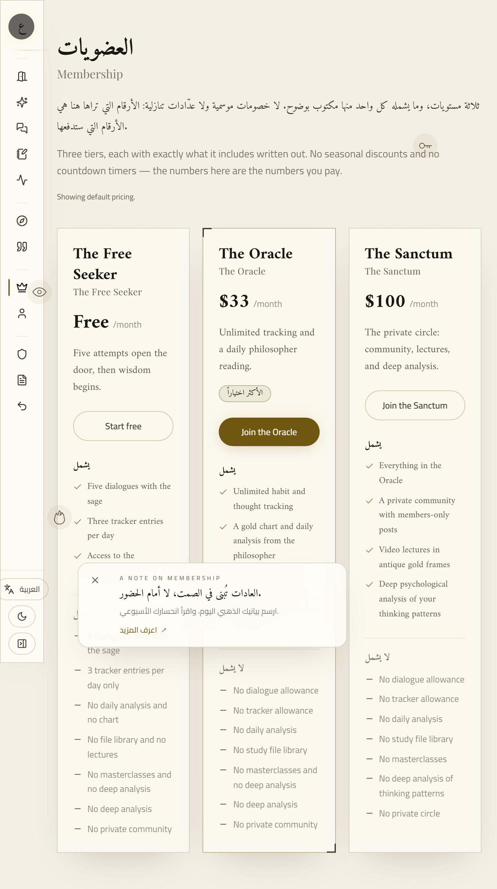 | 1 |
| `/privacy` | mobile-360 | ازاحة تخطيط (CLS) | CLS 0.1100 على http://localhost:3000/privacy —_sources: 0.074 ← nav[aria-label="أقسام هذه الوثيقة · Sections"], p.mt-4.border-t, unknown, p.display-arabic.mt-2, unknown \| 0.036 ← nav[aria-label="أقسام هذه الوثيقة · Sections"], p.mt-4.border-t, p.display-arabic.mt-2, unknown \| 0 ← span.text-[10px].leading-tight, span.text-[10px].leading-tight |  | 1 |
| `/privacy` | tablet-768 | ازاحة تخطيط (CLS) | CLS 0.1161 على http://localhost:3000/privacy —_sources: 0.044 ← div.flex-col.gap-10, nav[aria-label="أقسام هذه الوثيقة · Sections"], p.mt-4.border-t \| 0.042 ← div.flex-col.gap-10, nav[aria-label="أقسام هذه الوثيقة · Sections"], p.mt-4.border-t, unknown, unknown \| 0.03 ← div.flex-col.gap-10, nav[aria-label="أقسام هذه الوثيقة · Sections"], p.mt-4.border-t | 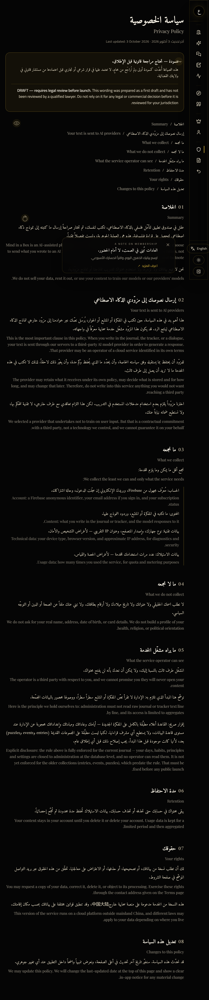 | 1 |
| `/privacy` | tablet-768 | ازاحة تخطيط (CLS) | CLS 0.1289 على http://localhost:3000/privacy —_sources: 0.066 ← div.mx-auto.max-w-3xl \| 0.034 ← div.flex-col.gap-10, p.mt-4.border-t, unknown, unknown, li \| 0.029 ← div.flex-col.gap-10, nav[aria-label="أقسام هذه الوثيقة · Sections"], p.mt-4.border-t | 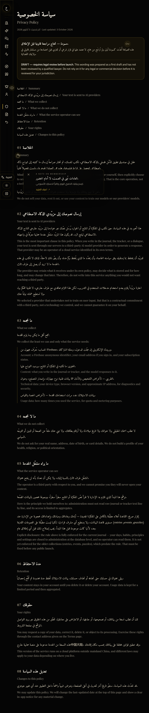 | 1 |
| `/privacy` | tablet-768 | ازاحة تخطيط (CLS) | CLS 0.1186 على http://localhost:3000/privacy —_sources: 0.066 ← div.mx-auto.max-w-3xl \| 0.029 ← div.flex-col.gap-10, nav[aria-label="أقسام هذه الوثيقة · Sections"], p.mt-4.border-t \| 0.017 ← div.mb-4, p.mt-4.border-t, unknown, unknown, unknown | 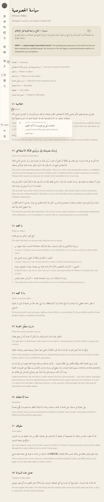 | 1 |
| `/refund` | tablet-768 | ازاحة تخطيط (CLS) | CLS 0.1336 على http://localhost:3000/refund —_sources: 0.048 ← div.flex-col.gap-10, nav[aria-label="أقسام هذه الوثيقة · Sections"], p.mt-4.border-t, unknown, div.mb-4 \| 0.044 ← div.flex-col.gap-10, nav[aria-label="أقسام هذه الوثيقة · Sections"], p.mt-4.border-t \| 0.042 ← div.flex-col.gap-10, nav[aria-label="أقسام هذه الوثيقة · Sections"], p.mt-4.border-t, unknown, unknown | 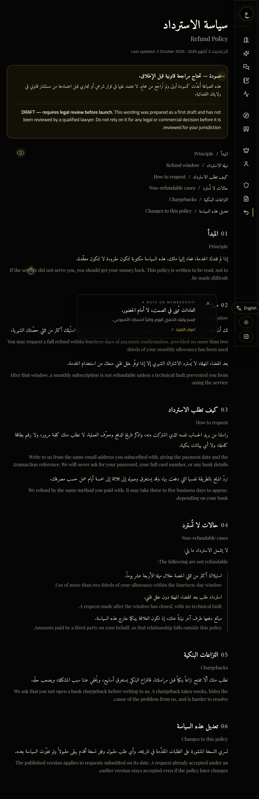 | 1 |
| `/refund` | tablet-768 | ازاحة تخطيط (CLS) | CLS 0.1284 على http://localhost:3000/refund —_sources: 0.066 ← div.mx-auto.max-w-3xl \| 0.035 ← div.flex-col.gap-10, nav[aria-label="أقسام هذه الوثيقة · Sections"], p.mt-4.border-t, div.mb-4 \| 0.027 ← div.flex-col.gap-10, p.mt-4.border-t, unknown, unknown, li | 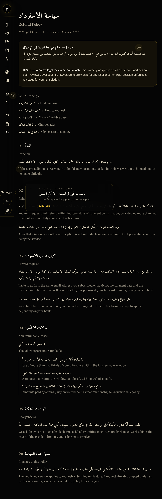 | 1 |
| `/refund` | tablet-768 | ازاحة تخطيط (CLS) | CLS 0.1077 على http://localhost:3000/refund —_sources: 0.044 ← div.flex-col.gap-10, nav[aria-label="أقسام هذه الوثيقة · Sections"], p.mt-4.border-t \| 0.035 ← div.flex-col.gap-10, nav[aria-label="أقسام هذه الوثيقة · Sections"], p.mt-4.border-t, div.mb-4 \| 0.029 ← div.flex-col.gap-10, p.mt-4.border-t, unknown, unknown, li | 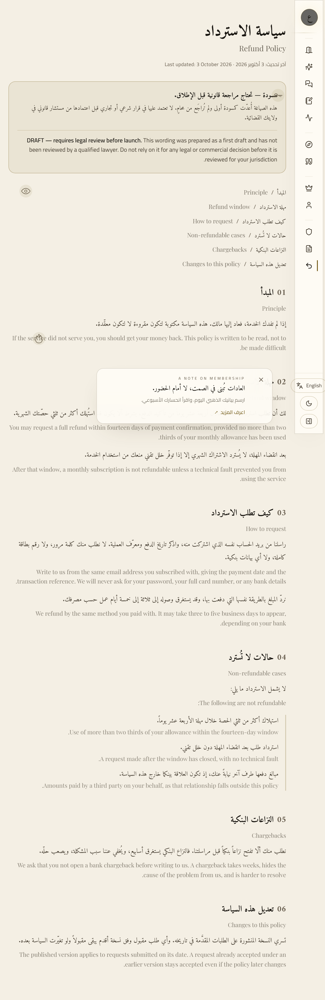 | 1 |
| `/refund` | tablet-768 | ازاحة تخطيط (CLS) | CLS 0.1545 على http://localhost:3000/refund —_sources: 0.066 ← div.mx-auto.max-w-3xl \| 0.046 ← div.flex-col.gap-10, nav[aria-label="أقسام هذه الوثيقة · Sections"], p.mt-4.border-t, div.mb-4 \| 0.042 ← div.flex-col.gap-10, nav[aria-label="أقسام هذه الوثيقة · Sections"], p.mt-4.border-t, unknown, unknown | 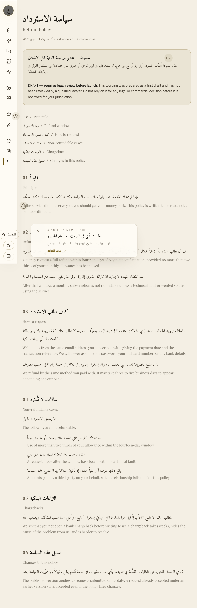 | 1 |
| `/sanctum` | mobile-360 | ازاحة تخطيط (CLS) | CLS 0.1202 على http://localhost:3000/sanctum —_sources: 0.069 ← footer.display-arabic.pb-10 \| 0.049 ← a.btn-gold.py-3, footer.display-arabic.pb-10, div.mt-9.flex-wrap, unknown \| 0.001 ← text-node, unknown, unknown, unknown, unknown | 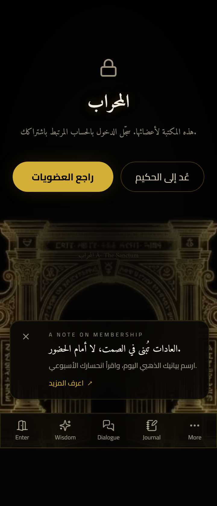 | 1 |
| `/membership` | mobile-360 | ازاحة تخطيط (CLS) | CLS 0.1191 على http://localhost:3000/pricing —_sources: 0.067 ← article.glass.flex-col, p.mt-3.leading-relaxed, unknown, unknown, unknown \| 0.052 ← article.glass.flex-col, p.mt-3.leading-relaxed, p.mt-5.text-xs, section.mt-7 | 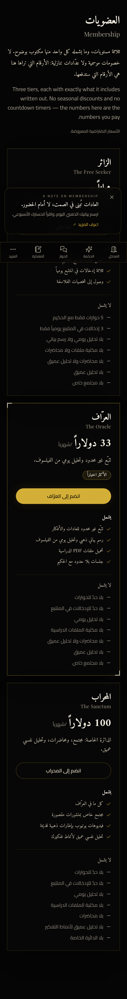 | 1 |
| `/membership` | tablet-768 | ازاحة تخطيط (CLS) | CLS 0.1554 على http://localhost:3000/pricing —_sources: 0.14 ← article.glass.flex-col, article.glass.flex-col, article.glass.flex-col, header.mb-10.max-w-2xl, li.items-start.gap-2 \| 0.009 ← a.mt-6.inline-flex, unknown, section.mt-7, section.mt-6.border-t, section.mt-6.border-t \| 0.005 ← a.mt-6.inline-flex, section.mt-7, section.mt-6.border-t, p.display-arabic.mt-4, unknown | 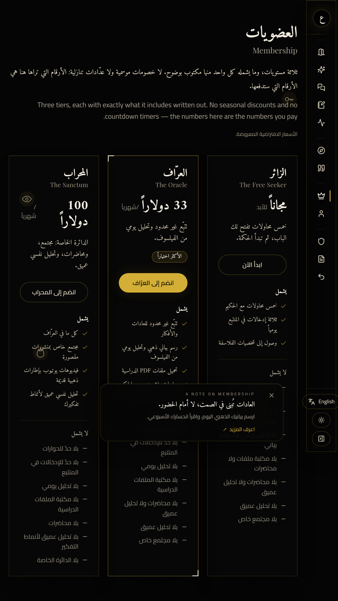 | 1 |
| `/membership` | tablet-768 | ازاحة تخطيط (CLS) | CLS 0.1953 على http://localhost:3000/pricing —_sources: 0.14 ← article.glass.flex-col, article.glass.flex-col, article.glass.flex-col, header.mb-10.max-w-2xl, li.items-start.gap-2 \| 0.039 ← unknown, unknown, section.mt-7, section.mt-6.border-t, unknown \| 0.016 ← section.mt-7, section.mt-6.border-t, section.mt-6.border-t, section.mt-6.border-t, a.mt-6.inline-flex | 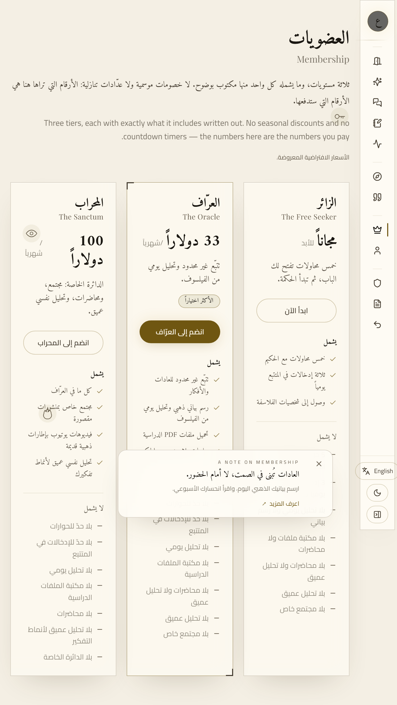 | 1 |

## الأداء لكل تركيبة

| المسار | النافذة | الثيم | اللغة | CLS | LCP (ms) | عنصر LCP |
|---|---|---|---|---|---|---|
| `/` | mobile-360 | dark | ar | 0.0000 | — | — |
| `/` | mobile-360 | dark | en | 0.0000 | — | — |
| `/` | mobile-360 | light | ar | 0.0000 | — | — |
| `/` | mobile-360 | light | en | 0.0000 | — | — |
| `/` | tablet-768 | dark | ar | 0.0524 | 880 | img.inset-0 |
| `/` | tablet-768 | dark | en | 0.0130 | 904 | img.inset-0 |
| `/` | tablet-768 | light | ar | 0.0132 | 932 | img.inset-0 |
| `/` | tablet-768 | light | en | 0.0130 | 856 | img.inset-0 |
| `/` | desktop-1440 | dark | ar | 0.0103 | 948 | img.inset-0 |
| `/` | desktop-1440 | dark | en | 0.0334 | 980 | img.inset-0 |
| `/` | desktop-1440 | light | ar | 0.0103 | 868 | img.inset-0 |
| `/` | desktop-1440 | light | en | 0.0334 | 988 | img.inset-0 |
| `/enter` | mobile-360 | dark | ar | 0.0000 | 1372 | img.inset-0 |
| `/enter` | mobile-360 | dark | en | 0.0027 | 1340 | img.inset-0 |
| `/enter` | mobile-360 | light | ar | 0.0150 | 1028 | img.inset-0 |
| `/enter` | mobile-360 | light | en | 0.0000 | 852 | img.inset-0 |
| `/enter` | tablet-768 | dark | ar | 0.0484 | 836 | img.inset-0 |
| `/enter` | tablet-768 | dark | en | 0.0443 | 1140 | img.inset-0 |
| `/enter` | tablet-768 | light | ar | 0.0484 | 1040 | img.inset-0 |
| `/enter` | tablet-768 | light | en | 0.0443 | 900 | img.inset-0 |
| `/enter` | desktop-1440 | dark | ar | 0.0374 | 996 | img.inset-0 |
| `/enter` | desktop-1440 | dark | en | 0.0357 | 860 | img.inset-0 |
| `/enter` | desktop-1440 | light | ar | 0.0374 | 820 | img.inset-0 |
| `/enter` | desktop-1440 | light | en | 0.0357 | 880 | img.inset-0 |
| `/wisdom` | mobile-360 | dark | ar | 0.0038 | 440 | p.display-arabic.mt-4 |
| `/wisdom` | mobile-360 | dark | en | 0.0010 | 432 | p.display-arabic.mt-4 |
| `/wisdom` | mobile-360 | light | ar | 0.0010 | 436 | p.display-arabic.mt-4 |
| `/wisdom` | mobile-360 | light | en | 0.0009 | 428 | p.display-arabic.mt-4 |
| `/wisdom` | tablet-768 | dark | ar | 0.0230 | 456 | p.display-arabic.mt-4 |
| `/wisdom` | tablet-768 | dark | en | 0.0307 | 460 | p.display-arabic.mt-4 |
| `/wisdom` | tablet-768 | light | ar | 0.0307 | 476 | p.display-arabic.mt-4 |
| `/wisdom` | tablet-768 | light | en | 0.0231 | 448 | p.display-arabic.mt-4 |
| `/wisdom` | desktop-1440 | dark | ar | 0.0099 | 476 | p.display-arabic.mt-4 |
| `/wisdom` | desktop-1440 | dark | en | 0.0133 | 480 | p.display-arabic.mt-4 |
| `/wisdom` | desktop-1440 | light | ar | 0.0134 | 480 | p.display-arabic.mt-4 |
| `/wisdom` | desktop-1440 | light | en | 0.0099 | 516 | p.display-arabic.mt-4 |
| `/dialogue` | mobile-360 | dark | ar | 0.0008 | 460 | p.display-arabic.mt-4 |
| `/dialogue` | mobile-360 | dark | en | 0.0058 | 520 | p.display-arabic.mt-4 |
| `/dialogue` | mobile-360 | light | ar | 0.0349 | 464 | p.display-arabic.mt-4 |
| `/dialogue` | mobile-360 | light | en | 0.0320 | 456 | p.display-arabic.mt-4 |
| `/dialogue` | tablet-768 | dark | ar | 0.0707 | 876 | img.inset-0 |
| `/dialogue` | tablet-768 | dark | en | 0.0710 | 932 | img.inset-0 |
| `/dialogue` | tablet-768 | light | ar | 0.0701 | 960 | img.inset-0 |
| `/dialogue` | tablet-768 | light | en | 0.0514 | 1136 | img.inset-0 |
| `/dialogue` | desktop-1440 | dark | ar | 0.0475 | 972 | img.inset-0 |
| `/dialogue` | desktop-1440 | dark | en | 0.0493 | 864 | img.inset-0 |
| `/dialogue` | desktop-1440 | light | ar | 0.0489 | 940 | img.inset-0 |
| `/dialogue` | desktop-1440 | light | en | 0.0489 | 952 | img.inset-0 |
| `/journal` | mobile-360 | dark | ar | 0.0038 | 492 | p.display-arabic.mb-4 |
| `/journal` | mobile-360 | dark | en | 0.0496 | 480 | p.display-arabic.mb-4 |
| `/journal` | mobile-360 | light | ar | 0.0495 | 468 | p.display-arabic.mb-4 |
| `/journal` | mobile-360 | light | en | 0.0497 | 484 | p.display-arabic.mb-4 |
| `/journal` | tablet-768 | dark | ar | 0.0695 | 1084 | img.inset-0 |
| `/journal` | tablet-768 | dark | en | 0.0697 | 1196 | img.inset-0 |
| `/journal` | tablet-768 | light | ar | 0.0695 | 1088 | img.inset-0 |
| `/journal` | tablet-768 | light | en | 0.0706 | 1264 | img.inset-0 |
| `/journal` | desktop-1440 | dark | ar | 0.0483 | 1088 | img.inset-0 |
| `/journal` | desktop-1440 | dark | en | 0.0486 | 1212 | img.inset-0 |
| `/journal` | desktop-1440 | light | ar | 0.0484 | 1196 | img.inset-0 |
| `/journal` | desktop-1440 | light | en | 0.0483 | 1128 | img.inset-0 |
| `/tracker` | mobile-360 | dark | ar | 0.0151 | 800 | img.inset-0 |
| `/tracker` | mobile-360 | dark | en | 0.0036 | 740 | img.inset-0 |
| `/tracker` | mobile-360 | light | ar | 0.0032 | 728 | img.inset-0 |
| `/tracker` | mobile-360 | light | en | 0.0163 | 716 | img.inset-0 |
| `/tracker` | tablet-768 | dark | ar | 0.0402 | 868 | img.inset-0 |
| `/tracker` | tablet-768 | dark | en | 0.0404 | 932 | img.inset-0 |
| `/tracker` | tablet-768 | light | ar | 0.0402 | 844 | img.inset-0 |
| `/tracker` | tablet-768 | light | en | 0.0402 | 900 | img.inset-0 |
| `/tracker` | desktop-1440 | dark | ar | 0.0324 | 932 | img.inset-0 |
| `/tracker` | desktop-1440 | dark | en | 0.0325 | 920 | img.inset-0 |
| `/tracker` | desktop-1440 | light | ar | 0.0325 | 904 | img.inset-0 |
| `/tracker` | desktop-1440 | light | en | 0.0325 | 920 | img.inset-0 |
| `/paths` | mobile-360 | dark | ar | 0.0004 | 452 | p.display-arabic.mt-4 |
| `/paths` | mobile-360 | dark | en | 0.0000 | 416 | p.display-arabic.mt-4 |
| `/paths` | mobile-360 | light | ar | 0.0004 | 428 | p.display-arabic.mt-4 |
| `/paths` | mobile-360 | light | en | 0.0958 | 436 | p.display-arabic.mt-4 |
| `/paths` | tablet-768 | dark | ar | 0.1102 | 548 | p.display-arabic.mt-4 |
| `/paths` | tablet-768 | dark | en | 0.0713 | 592 | p.display-arabic.mt-4 |
| `/paths` | tablet-768 | light | ar | 0.0960 | 620 | p.display-arabic.mt-4 |
| `/paths` | tablet-768 | light | en | 0.0730 | 492 | p.display-arabic.mt-4 |
| `/paths` | desktop-1440 | dark | ar | 0.0203 | 496 | p.display-arabic.mt-4 |
| `/paths` | desktop-1440 | dark | en | 0.0182 | 488 | p.display-arabic.mt-4 |
| `/paths` | desktop-1440 | light | ar | 0.0192 | 496 | p.display-arabic.mt-4 |
| `/paths` | desktop-1440 | light | en | 0.0173 | 496 | p.display-arabic.mt-4 |
| `/quotes` | mobile-360 | dark | ar | 0.0661 | 456 | p.display-arabic.mt-4 |
| `/quotes` | mobile-360 | dark | en | 0.0228 | 464 | p.display-arabic.mt-4 |
| `/quotes` | mobile-360 | light | ar | 0.0547 | 468 | p.display-arabic.mt-4 |
| `/quotes` | mobile-360 | light | en | 0.0167 | 648 | p.display-arabic.mt-4 |
| `/quotes` | tablet-768 | dark | ar | 0.0568 | 528 | blockquote.display-arabic.text-lg |
| `/quotes` | tablet-768 | dark | en | 0.0751 | 532 | blockquote.display-arabic.text-lg |
| `/quotes` | tablet-768 | light | ar | 0.0695 | 768 | blockquote.display-arabic.text-lg |
| `/quotes` | tablet-768 | light | en | 0.0702 | 520 | blockquote.display-arabic.text-lg |
| `/quotes` | desktop-1440 | dark | ar | 0.0199 | 520 | blockquote.display-arabic.text-lg |
| `/quotes` | desktop-1440 | dark | en | 0.0149 | 504 | blockquote.display-arabic.text-lg |
| `/quotes` | desktop-1440 | light | ar | 0.0198 | 512 | blockquote.display-arabic.text-lg |
| `/quotes` | desktop-1440 | light | en | 0.0151 | 508 | blockquote.display-arabic.text-lg |
| `/pricing` | mobile-360 | dark | ar | 0.0087 | 468 | p.mt-3.leading-relaxed |
| `/pricing` | mobile-360 | dark | en | 0.0135 | 532 | p.mt-3.leading-relaxed |
| `/pricing` | mobile-360 | light | ar | 0.0098 | 428 | p.mt-3.leading-relaxed |
| `/pricing` | mobile-360 | light | en | 0.1237 | 512 | p.mt-3.leading-relaxed |
| `/pricing` | tablet-768 | dark | ar | 0.1953 | 540 | p.display-arabic.mt-5 |
| `/pricing` | tablet-768 | dark | en | 0.2009 | 496 | p.display-arabic.mt-5 |
| `/pricing` | tablet-768 | light | ar | 0.1953 | 532 | p.display-arabic.mt-5 |
| `/pricing` | tablet-768 | light | en | 0.1997 | 504 | p.display-arabic.mt-5 |
| `/pricing` | desktop-1440 | dark | ar | 0.0274 | 520 | p.display-arabic.mt-5 |
| `/pricing` | desktop-1440 | dark | en | 0.0347 | 564 | p.display-arabic.mt-5 |
| `/pricing` | desktop-1440 | light | ar | 0.0219 | 732 | p.display-arabic.mt-5 |
| `/pricing` | desktop-1440 | light | en | 0.0323 | 584 | p.display-arabic.mt-5 |
| `/privacy` | mobile-360 | dark | ar | 0.0774 | 592 | p.mt-4.border-t |
| `/privacy` | mobile-360 | dark | en | 0.1100 | 664 | p.mt-4.border-t |
| `/privacy` | mobile-360 | light | ar | 0.0699 | 472 | p.mt-4.border-t |
| `/privacy` | mobile-360 | light | en | 0.0362 | 456 | p.mt-4.border-t |
| `/privacy` | tablet-768 | dark | ar | 0.1161 | 476 | p.mt-4.border-t |
| `/privacy` | tablet-768 | dark | en | 0.1289 | 476 | p.mt-4.border-t |
| `/privacy` | tablet-768 | light | ar | 0.0734 | 472 | p.mt-4.border-t |
| `/privacy` | tablet-768 | light | en | 0.1186 | 456 | p.mt-4.border-t |
| `/privacy` | desktop-1440 | dark | ar | 0.0331 | 476 | p.mt-4.border-t |
| `/privacy` | desktop-1440 | dark | en | 0.0371 | 448 | p.mt-4.border-t |
| `/privacy` | desktop-1440 | light | ar | 0.0376 | 492 | p.mt-4.border-t |
| `/privacy` | desktop-1440 | light | en | 0.0379 | 468 | p.mt-4.border-t |
| `/terms` | mobile-360 | dark | ar | 0.0362 | 472 | p.mt-4.border-t |
| `/terms` | mobile-360 | dark | en | 0.0382 | 472 | p.mt-4.border-t |
| `/terms` | mobile-360 | light | ar | 0.0836 | 528 | p.mt-4.border-t |
| `/terms` | mobile-360 | light | en | 0.0570 | 488 | p.mt-4.border-t |
| `/terms` | tablet-768 | dark | ar | 0.1000 | 472 | p.mt-4.border-t |
| `/terms` | tablet-768 | dark | en | 0.1016 | 480 | p.mt-4.border-t |
| `/terms` | tablet-768 | light | ar | 0.0756 | 532 | p.mt-4.border-t |
| `/terms` | tablet-768 | light | en | 0.1016 | 472 | p.mt-4.border-t |
| `/terms` | desktop-1440 | dark | ar | 0.0295 | 584 | p.mt-4.border-t |
| `/terms` | desktop-1440 | dark | en | 0.0251 | 476 | p.mt-4.border-t |
| `/terms` | desktop-1440 | light | ar | 0.0312 | 548 | p.mt-4.border-t |
| `/terms` | desktop-1440 | light | en | 0.0251 | 628 | p.mt-4.border-t |
| `/refund` | mobile-360 | dark | ar | 0.0815 | 444 | p.mt-4.border-t |
| `/refund` | mobile-360 | dark | en | 0.0783 | 516 | p.mt-4.border-t |
| `/refund` | mobile-360 | light | ar | 0.0070 | 460 | p.mt-4.border-t |
| `/refund` | mobile-360 | light | en | 0.0382 | 448 | p.mt-4.border-t |
| `/refund` | tablet-768 | dark | ar | 0.1336 | 472 | p.mt-4.border-t |
| `/refund` | tablet-768 | dark | en | 0.1284 | 484 | p.mt-4.border-t |
| `/refund` | tablet-768 | light | ar | 0.1077 | 488 | p.mt-4.border-t |
| `/refund` | tablet-768 | light | en | 0.1545 | 464 | p.mt-4.border-t |
| `/refund` | desktop-1440 | dark | ar | 0.0240 | 456 | p.mt-4.border-t |
| `/refund` | desktop-1440 | dark | en | 0.0348 | 500 | p.mt-4.border-t |
| `/refund` | desktop-1440 | light | ar | 0.0353 | 492 | p.mt-4.border-t |
| `/refund` | desktop-1440 | light | en | 0.0214 | 468 | p.mt-4.border-t |
| `/oracle` | mobile-360 | dark | ar | 0.0520 | 688 | h1.gold-text-glow.display-arabic |
| `/oracle` | mobile-360 | dark | en | 0.0520 | 756 | h1.gold-text-glow.display-arabic |
| `/oracle` | mobile-360 | light | ar | 0.0009 | 716 | h1.gold-text-glow.display-arabic |
| `/oracle` | mobile-360 | light | en | 0.0520 | 800 | h1.gold-text-glow.display-arabic |
| `/oracle` | tablet-768 | dark | ar | 0.0916 | 960 | img.inset-0 |
| `/oracle` | tablet-768 | dark | en | 0.0905 | 1176 | img.inset-0 |
| `/oracle` | tablet-768 | light | ar | 0.0915 | 884 | img.inset-0 |
| `/oracle` | tablet-768 | light | en | 0.0905 | 1008 | img.inset-0 |
| `/oracle` | desktop-1440 | dark | ar | 0.0685 | 1124 | img.inset-0 |
| `/oracle` | desktop-1440 | dark | en | 0.0680 | 1256 | img.inset-0 |
| `/oracle` | desktop-1440 | light | ar | 0.0689 | 1360 | img.inset-0 |
| `/oracle` | desktop-1440 | light | en | 0.0679 | 1220 | img.inset-0 |
| `/sanctum` | mobile-360 | dark | ar | 0.0534 | 904 | h1.gold-text-glow.display-arabic |
| `/sanctum` | mobile-360 | dark | en | 0.1202 | 972 | h1.gold-text-glow.display-arabic |
| `/sanctum` | mobile-360 | light | ar | 0.0538 | 1312 | h1.gold-text-glow.display-arabic |
| `/sanctum` | mobile-360 | light | en | 0.0538 | 996 | h1.gold-text-glow.display-arabic |
| `/sanctum` | tablet-768 | dark | ar | 0.0923 | 1164 | img.inset-0 |
| `/sanctum` | tablet-768 | dark | en | 0.0908 | 1216 | img.inset-0 |
| `/sanctum` | tablet-768 | light | ar | 0.0915 | 1248 | img.inset-0 |
| `/sanctum` | tablet-768 | light | en | 0.0913 | 1112 | img.inset-0 |
| `/sanctum` | desktop-1440 | dark | ar | 0.0685 | 1292 | img.inset-0 |
| `/sanctum` | desktop-1440 | dark | en | 0.0681 | 1076 | img.inset-0 |
| `/sanctum` | desktop-1440 | light | ar | 0.0705 | 1128 | img.inset-0 |
| `/sanctum` | desktop-1440 | light | en | 0.0682 | 1276 | img.inset-0 |
| `/account` | mobile-360 | dark | ar | 0.0051 | 492 | p.text-xs.leading-relaxed |
| `/account` | mobile-360 | dark | en | 0.0051 | 520 | p.text-xs.leading-relaxed |
| `/account` | mobile-360 | light | ar | 0.0041 | 508 | p.text-xs.leading-relaxed |
| `/account` | mobile-360 | light | en | 0.0041 | 512 | p.text-xs.leading-relaxed |
| `/account` | tablet-768 | dark | ar | 0.0366 | 764 | p.rounded-xl.px-4 |
| `/account` | tablet-768 | dark | en | 0.0336 | 576 | p.rounded-xl.px-4 |
| `/account` | tablet-768 | light | ar | 0.0337 | 1372 | p.display-arabic.mt-1.5 |
| `/account` | tablet-768 | light | en | 0.0336 | 596 | p.rounded-xl.px-4 |
| `/account` | desktop-1440 | dark | ar | 0.0127 | 588 | p.rounded-xl.px-4 |
| `/account` | desktop-1440 | dark | en | 0.0130 | 548 | p.rounded-xl.px-4 |
| `/account` | desktop-1440 | light | ar | 0.0125 | 568 | p.rounded-xl.px-4 |
| `/account` | desktop-1440 | light | en | 0.0127 | 1260 | p.display-arabic.mt-1.5 |
| `/god-mode-admin` | mobile-360 | dark | ar | 0.0412 | 888 | p.mt-3.leading-relaxed |
| `/god-mode-admin` | mobile-360 | dark | en | 0.0412 | 928 | p.mt-3.leading-relaxed |
| `/god-mode-admin` | mobile-360 | light | ar | 0.0445 | 644 | p.mt-3.leading-relaxed |
| `/god-mode-admin` | mobile-360 | light | en | 0.0630 | 652 | p.mt-3.leading-relaxed |
| `/god-mode-admin` | tablet-768 | dark | ar | 0.0397 | 704 | p.mt-3.leading-relaxed |
| `/god-mode-admin` | tablet-768 | dark | en | 0.0398 | 780 | p.mt-3.leading-relaxed |
| `/god-mode-admin` | tablet-768 | light | ar | 0.0384 | 712 | p.mt-3.leading-relaxed |
| `/god-mode-admin` | tablet-768 | light | en | 0.0401 | 672 | p.mt-3.leading-relaxed |
| `/god-mode-admin` | desktop-1440 | dark | ar | 0.0168 | 684 | p.mt-3.leading-relaxed |
| `/god-mode-admin` | desktop-1440 | dark | en | 0.0170 | 684 | p.mt-3.leading-relaxed |
| `/god-mode-admin` | desktop-1440 | light | ar | 0.0171 | 996 | p.mt-3.leading-relaxed |
| `/god-mode-admin` | desktop-1440 | light | en | 0.0167 | 724 | p.mt-3.leading-relaxed |
| `/membership` | mobile-360 | dark | ar | 0.1191 | 652 | p.mt-3.leading-relaxed |
| `/membership` | mobile-360 | dark | en | 0.0131 | 596 | p.mt-3.leading-relaxed |
| `/membership` | mobile-360 | light | ar | 0.0999 | 592 | p.mt-3.leading-relaxed |
| `/membership` | mobile-360 | light | en | 0.0896 | 656 | p.mt-3.leading-relaxed |
| `/membership` | tablet-768 | dark | ar | 0.1554 | 564 | p.display-arabic.mt-5 |
| `/membership` | tablet-768 | dark | en | 0.1993 | 560 | p.display-arabic.mt-5 |
| `/membership` | tablet-768 | light | ar | 0.1953 | 556 | p.display-arabic.mt-5 |
| `/membership` | tablet-768 | light | en | 0.1993 | 564 | p.display-arabic.mt-5 |
| `/membership` | desktop-1440 | dark | ar | 0.0274 | 572 | p.display-arabic.mt-5 |
| `/membership` | desktop-1440 | dark | en | 0.0317 | 1132 | p.display-arabic.mt-5 |
| `/membership` | desktop-1440 | light | ar | 0.0273 | 544 | p.display-arabic.mt-5 |
| `/membership` | desktop-1440 | light | en | 0.0390 | 632 | p.display-arabic.mt-5 |

## مخالفات axe بالتفصيل

| القاعدة | الأثر | عدد العناصر | المسارات |
|---|---|---|---|
| `color-contrast` | serious | 51 | `/enter` `/wisdom` `/tracker` `/paths` `/quotes` `/pricing` `/privacy` `/terms` `/refund` `/account` `/membership` |

<details><summary>العناصر المخالفة كما يسمّيها axe</summary>

**`color-contrast`**

- a[data-audit-focus="2"] > .text-\[10px\].leading-tight — "الحكمة" Fix any of the following: Element has insufficient color contrast of 4.34 (foreground color: #7c766c, background color: #fdfbf4, font size: 7.5pt (10px), font weight: normal). Expected contrast ratio of 4.5:1
- a[data-audit-focus="3"] > .text-\[10px\].leading-tight — "الحوار" Fix any of the following: Element has insufficient color contrast of 4.34 (foreground color: #7c766c, background color: #fdfbf4, font size: 7.5pt (10px), font weight: normal). Expected contrast ratio of 4.5:1
- a[data-audit-focus="4"] > .text-\[10px\].leading-tight — "المفكرة" Fix any of the following: Element has insufficient color contrast of 4.34 (foreground color: #7c766c, background color: #fdfbf4, font size: 7.5pt (10px), font weight: normal). Expected contrast ratio of 4.5:1
- a[data-audit-focus="2"] > .text-\[10px\].leading-tight — "Wisdom" Fix any of the following: Element has insufficient color contrast of 4.34 (foreground color: #7c766c, background color: #fdfbf4, font size: 7.5pt (10px), font weight: normal). Expected contrast ratio of 4.5:1

</details>

## ما لم يحكم عليه axe

هذه ليست نجاحاً. هذه قواعد حمِّلها axe ثم رفض الحكم عليها — في `color-contrast` لأنه لم يستطع تحديد الخلفية خلف النص، وهو ما يحدث خلف طبقات اللوحات المصوّرة. قياس التباين على هذه المسارات مسؤول عن `probes.ts` في `scripts/audit/`.

| القاعدة | أكبر عدد عناصر لم يُحسم | المسارات |
|---|---|---|
| `color-contrast` | 61 | `/` `/enter` `/wisdom` `/dialogue` `/journal` `/tracker` `/paths` `/quotes` `/pricing` `/privacy` `/terms` `/refund` `/oracle` `/sanctum` `/account` `/membership` |

## كيف أُعيد الفحص

```bash
npm run build && npx next start -p 3000      # في نافذة طرفية أخرى
npm run audit:ui                            # الفحص الكامل
npm run audit:ui -- --only=/wisdom          # مسار واحد
npm run audit:ui -- --no-interact            # بدون النقر
npm run test:e2e -- audit-regression         # بوابة قبل الإطلاق
AUDIT_BASE_URL=https://…pages.dev npm run audit:ui   # على نشر حقيقي
```

اللقطات في `docs/audit/screenshots/`، والدليل الخام في `docs/audit/raw.json` (كل زيارة، كل مقياس، كل رابط). التقرير نفسه مكتوب آلياً من `scripts/audit/crawl.ts`؛ سجل الإصلاحات في `docs/audit/fixes.json` ويُرسَم هنا تحت «الإصلاحات».

## الإصلاحات — عيوب P0/P1 مُغلَقة

كل عيب هنا أُصلح بإزالة سببه لا بإخفاء علامته. السجل في `docs/audit/fixes.json`، ويُفحص آلياً: إذا عاد أي معرّف مذكور هنا إلى Findings أعلاه فالفحص يعدّه انحداراً.

### P0 — لا أحد يستطيع تسجيل الدخول

**Sign-in was impossible for every visitor**  `hydration-signin:/enter`

- **السبب:** src/lib/firebase/config.ts read its keys as process.env[key] — a computed index. Next.js substitutes the *text* of process.env.NEXT_PUBLIC_FOO into client bundles, one literal expression at a time. A computed index is not that expression, so nothing was substituted, the lookup ran against an empty object in the browser, and isFirebaseConfigured() answered false while the server said true. lib/firebase.ts, which builds firebaseConfig with static reads, was inlining correctly at the same time: one build, two contradictory answers.
- **ما تغيّر:** One literal process.env.NEXT_PUBLIC_FIREBASE_* read per key, in a single readFirebaseEnv(). src/lib/firebase/config.test.ts now reads that file's source text and fails if a computed process.env[ reappears.
- **الأثر:** On a correctly configured deploy the server rendered the sign-in form into the HTML and the browser threw it away (React #418/#423), re-rendering the sign-in-unavailable state. The journal, the tracker, /account and /god-mode-admin all sat behind the same broken answer. All 12 /enter combinations logged the mismatch. Every behavioural test in the repository passed throughout: under vitest process.env is a real object, so the broken path is indistinguishable from the working one, which is why the guard reads source text rather than behaviour.
- **حارس العودة:** src/lib/firebase/config.test.ts
- **مؤشّر العودة في الفحص:** `console:[pageerror] Minified React error #418`، `console:[pageerror] Minified React error #423` — لم يظهر

| قبل | بعد |
|---|---|
| 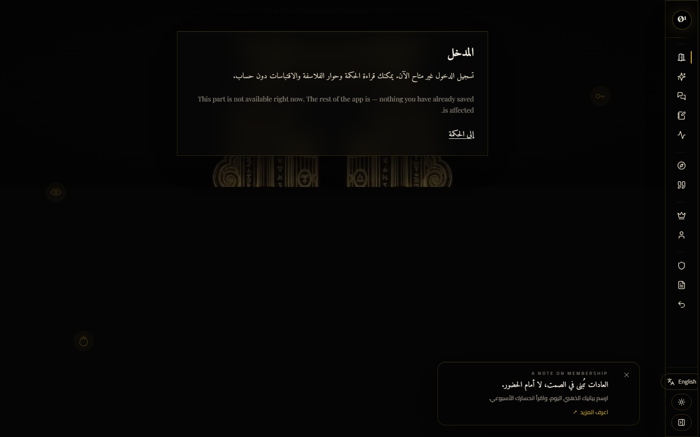 | 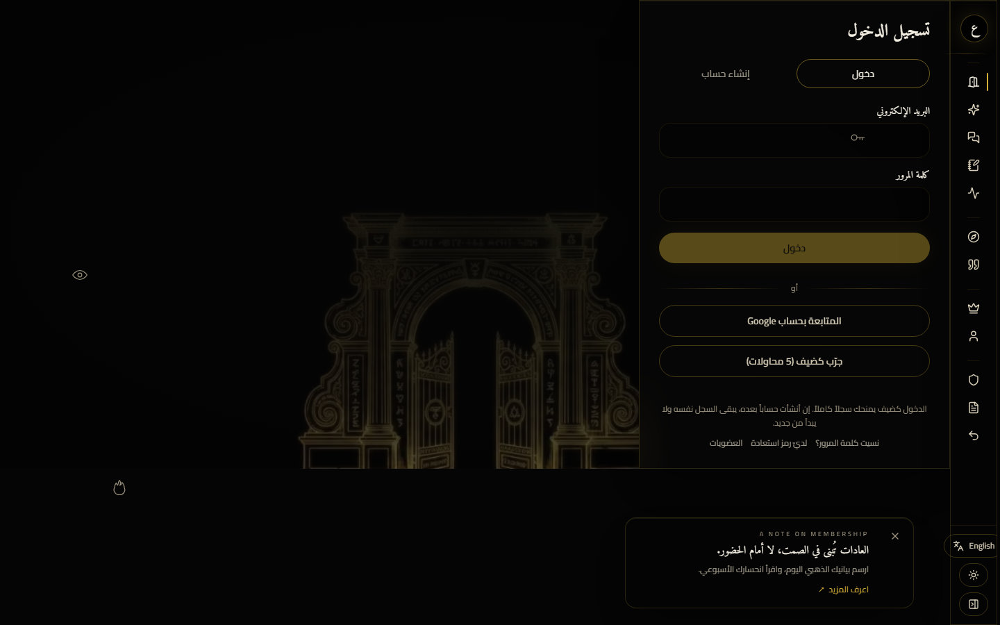 |

*Both screenshots look plausible. Only the console told them apart, which is why a hydration mismatch is classified as an error here and not a warning.*

### P0 — كل النصوص العربية المعروضة كانت حروفاً لاتينية

**Every displayed Arabic string rendered as Latin letters**  `mojibake-arabic-copy:src-wide`

- **السبب:** 337 lines across 11 component files held Arabic that had been saved after a cp1252 round trip: UTF-8 bytes decoded as cp1252 and written back as if that were the text. Every character of every word landed in U+00C0–U+00FF instead of the Arabic block. The codec is pinned to cp1252 rather than Latin-1 by the U+02C6 and U+201E characters in the corrupted runs — those are the cp1252 mappings of bytes 0x88 and 0x84, and a Latin-1 round trip could not have produced them. The mechanism that wrote them is not recorded anywhere in the repository; what is recorded is the exact inverse, which is why the repair is a decode and not a reconstruction.
- **ما تغيّر:** Decoded back, losslessly, by scripts/fix-mojibake.mjs. Every line is verified before it is written: the bytes must decode as valid UTF-8 under a fatal decoder, the result must contain Arabic, and the ASCII skeleton of the line must be byte-identical — the last is what stops a bad decode from editing code that sits beside a corrupted string. 337 of 337 lines repaired; none needed a human.
- **الأثر:** Every user-facing Arabic string on the journal, the account panel, the dialogue, the wisdom panel, the quotes, the tracker, the membership page, the riddle dialog, the persona cards and the shell navigation — the button labels, the notices, the empty states, the aria-labels, the error messages. Nothing detected it. The characters are real Latin-1 letters, so each corrupted glyph had a font, a colour, a passing contrast ratio and a real bounding box: the contrast probe passed, the clipping probe passed, axe passed, and 433 unit tests passed. The character count was even healthy — /journal rendered 2398 characters, every one of them unreadable. It surfaced only by accident, because one clicked control's label became a finding id and the corrupted label was finally legible.
- **حارس العودة:** scripts/check-mojibake.mjs, inside build:cf, plus 20 unit tests in scripts/lib/mojibake.test.mjs and a new crawler probe (`mojibake:`) that decodes the rendered DOM. The source gate detects it in a file; the crawler probe detects it on a page, so a corrupted string arriving from anywhere — a database field, a CMS value, a future refactor — is caught by the audit too.
- **مؤشّر العودة في الفحص:** `mojibake:` — لم يظهر

| قبل | بعد |
|---|---|
| 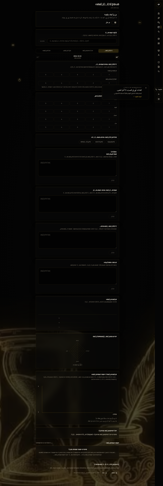 | 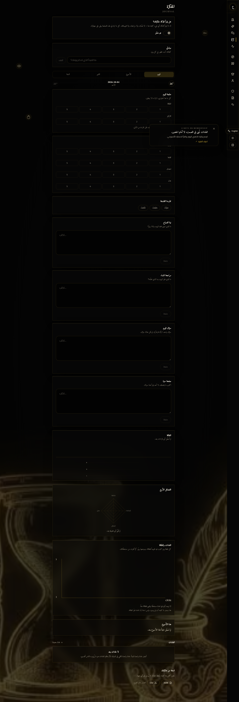 |

*The journal, in Arabic, at full width. Before: 2398 characters, all of them Latin-1 letters. Nothing in the layout moved, so a layout diff would show no change at all.*

| قبل | بعد |
|---|---|
| 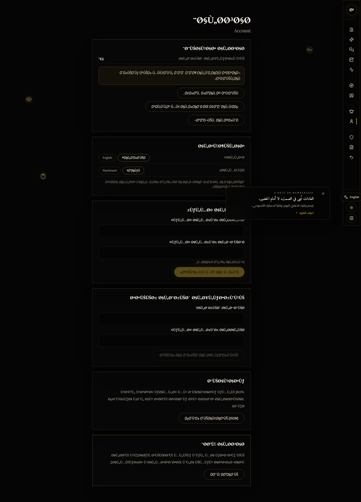 | 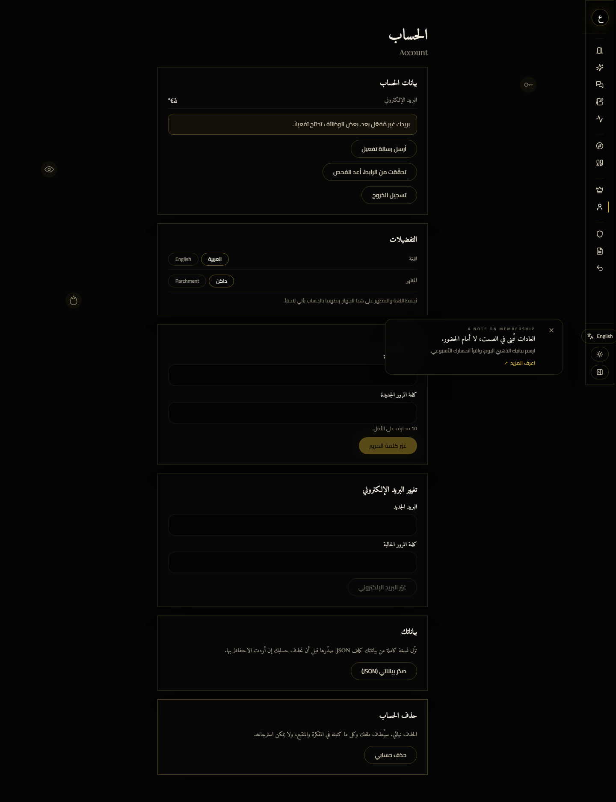 |

*The account panel. Before: the verification button, the notice and the error messages were all mojibake. The corrupted label of that button is what the first run reported as a finding id.*

| قبل | بعد |
|---|---|
| 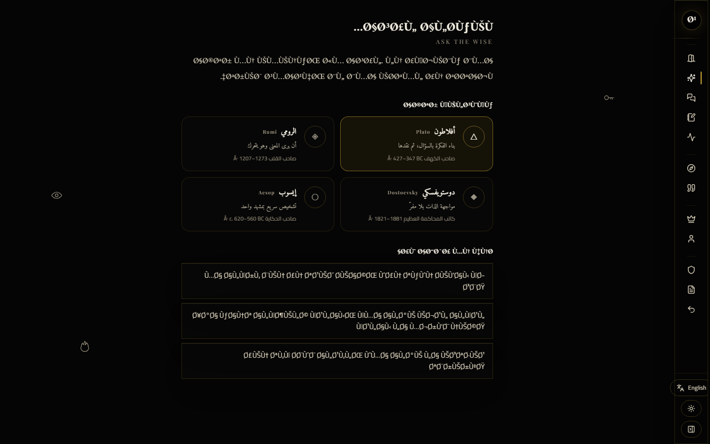 | 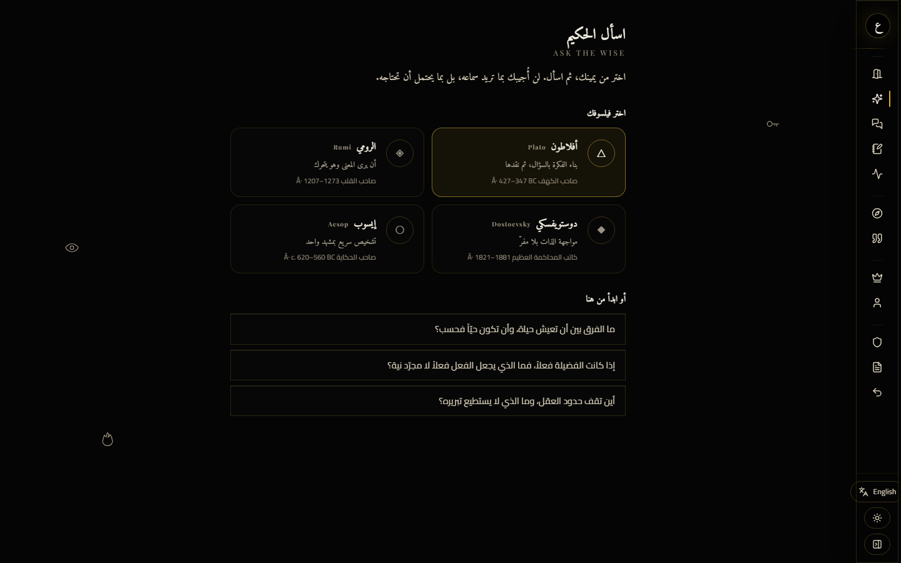 |

*The wisdom panel, including its opening question. Before: Latin-1 letters with correct contrast and correct spacing.*

| قبل | بعد |
|---|---|
| 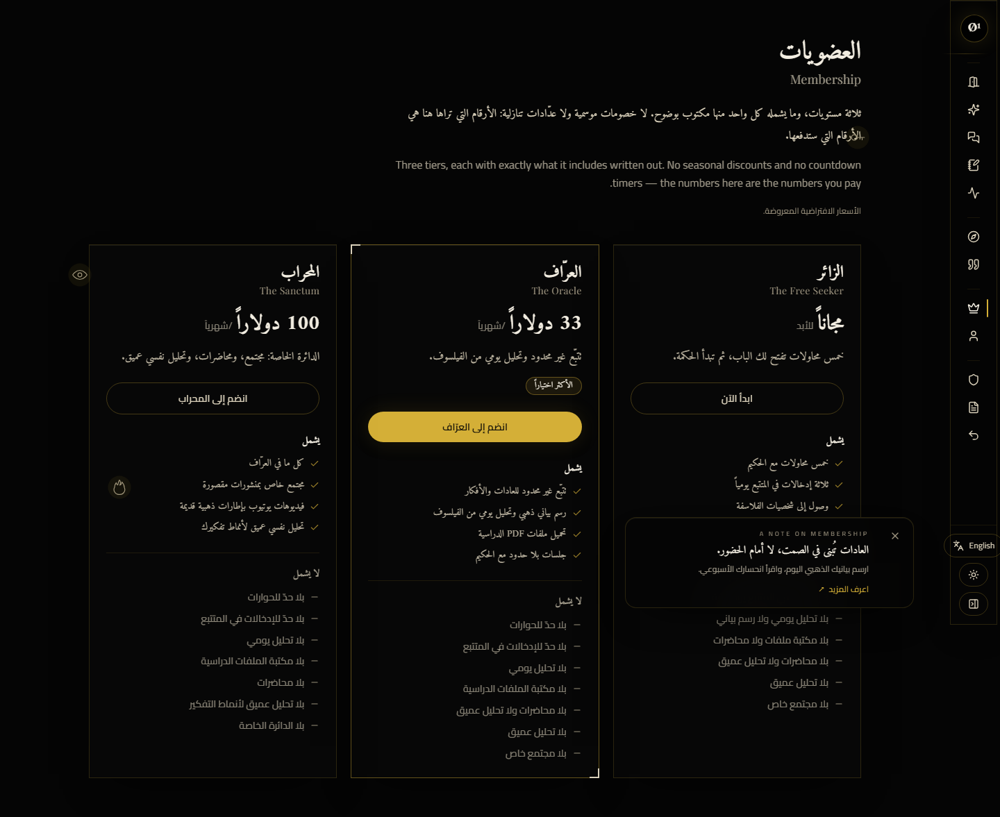 | 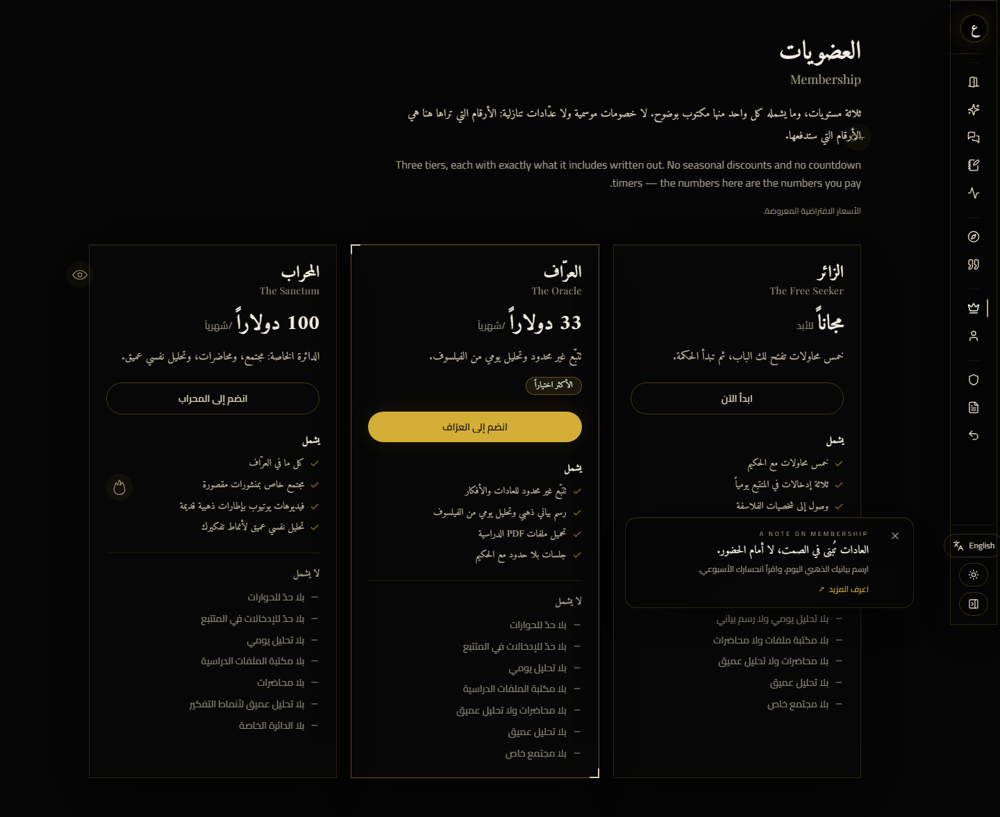 |

*The membership page, where the corruption also dragged a stray § through the middle dot: "MEMBERSHIP · …" became "MEMBERSHIP · …".*

### P1 — نص غير مقروء في 91 موضعاً

**Illegible text at 91 call sites**  `contrast-illegible:src-wide` — **عاد**

> **انحدار.** ظهر هذا العيب 132 مرة في هذا الفحص بعد أن كان مُصلَحاً (`contrast:span.text-4xl.font-bold:1.95`، `contrast:span.display-latin.text-[10px]:1.48`، `contrast:span.mt-1.5.text-[0.7rem]:1.48`). الحارس في `scripts/verify-contrast.mjs — now also scans src/ for opacity modifiers on text colours, resolves the worst case across both themes and all five backgrounds, fails below 3:1, and reports the 3:1–4.5:1 band without blocking. Its pair list grew from 11 to 33, adding the gold tokens and the composited glass and overlay panels. It runs inside build:cf.` لم يمنع عودته.

- **السبب:** Every token in the text ramp cleared WCAG AA at 100% — --gold 9.69:1 dark / 6.07:1 light, --gold-light 17.45/15.58, --gold-muted 13.28/9.32, --text-3 6.69/5.30. Then 210 call sites appended an opacity modifier, and the modifier became the whole story: text-gold-muted/55, the same token dimmed, shipped at 2.87:1. The lowest were text-gold/25 at 1.44:1 and text-gold-muted/30 at 1.69:1, on the landing hero, the sign-in panel, the quote cards and the journal.
- **ما تغيّر:** The P1 band — worst-case under 3:1 — moved to text-ink-3, the dimmest token that clears AA in both themes, which preserves the intended hierarchy instead of brightening captions into body copy. 91 sites across 24 files. The band boundary was measured rather than chosen: below 3:1 text cannot be read at any size, which is WCAG's own floor for content.
- **الأثر:** Text the reader was meant to read rendered at 1.44:1–2.90:1. This was invisible to verify-contrast.mjs, which checked 11 token *pairs* and never looked at a single *class*. Both checks were necessary; neither was sufficient.
- **حارس العودة:** scripts/verify-contrast.mjs — now also scans src/ for opacity modifiers on text colours, resolves the worst case across both themes and all five backgrounds, fails below 3:1, and reports the 3:1–4.5:1 band without blocking. Its pair list grew from 11 to 33, adding the gold tokens and the composited glass and overlay panels. It runs inside build:cf.
- **مؤشّر العودة في الفحص:** `contrast:` — **ظهر**

| قبل | بعد |
|---|---|
| 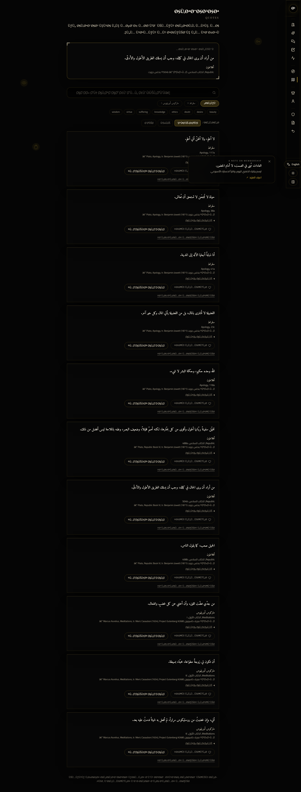 | 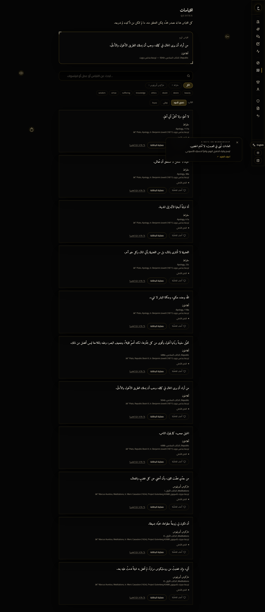 |

*The source locator under each quote, and the theme chips, at 2.87:1.*

| قبل | بعد |
|---|---|
| 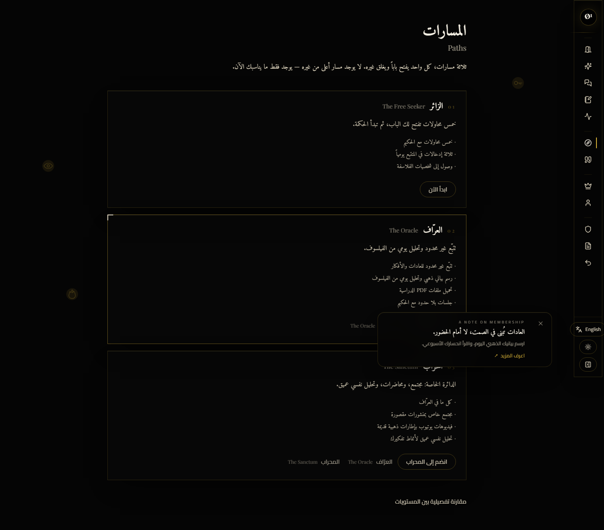 | 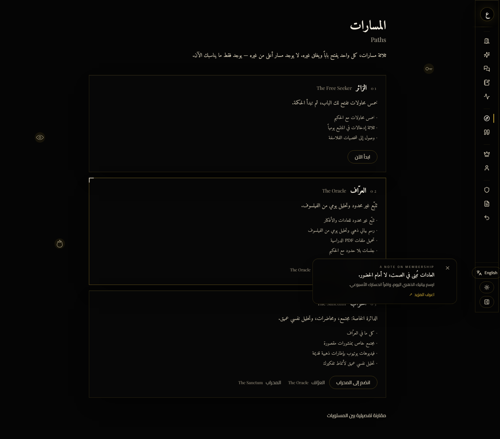 |

*The tier numerals and the Latin tier names on the comparison grid, at 1.87:1 and 2.10:1.*

| قبل | بعد |
|---|---|
|  |  |

*The guest-access note and the separator on the sign-in panel, at 2.94:1.*

### P1 — بقعة سوداء على الصفحة الفاتحة تكسر التباين

**A black blob on the light theme broke contrast**  `contrast-light-scrim:GreekColumns` — **عاد**

> **انحدار.** ظهر هذا العيب 132 مرة في هذا الفحص بعد أن كان مُصلَحاً (`contrast:span.text-4xl.font-bold:1.95`، `contrast:span.display-latin.text-[10px]:1.48`، `contrast:span.mt-1.5.text-[0.7rem]:1.48`). الحارس في `scripts/verify-contrast.mjs measures the composited result, and the crawler's contrast probe runs in both themes against all five background layers. The probe is what caught this; the token change is what closed it.` لم يمنع عودته.

- **السبب:** GreekColumns.tsx drew its readability scrim as a literal rgba(5,5,5,0.86) — a hardcoded near-black with no theme branch. The sibling component art/ArtLayer builds the same scrim from the volcanic token and carries the rule in its header comment: #050505 in the dark theme and #f4efe4 in Parchment, so one declaration serves both. Two lines below the scrim, GreekColumns already used from-volcanic; only the radial gradient was hardcoded. The result was a near-black ellipse painted over cream parchment, and since the text tokens had correctly flipped to their light-theme values, dark text landed on dark artwork.
- **ما تغيّر:** All three literal colours in the component now read the token: the scrim from rgb(var(--volcanic)/…) and the two gold veils from rgb(var(--gold)/…).
- **الأثر:** In Parchment the landing hero's decorative letter measured 1.95:1 against a 3:1 floor, and on /wisdom and /dialogue the persona name, the dates and the description measured 1.48:1 and 2.03:1 against a 4.5:1 floor — 42 combinations each. All dark-theme combinations were unaffected, which is why the defect survived a run that looked at both themes and reported the light one as clean.
- **حارس العودة:** scripts/verify-contrast.mjs measures the composited result, and the crawler's contrast probe runs in both themes against all five background layers. The probe is what caught this; the token change is what closed it.
- **مؤشّر العودة في الفحص:** `contrast:` — **ظهر**

| قبل | بعد |
|---|---|
| 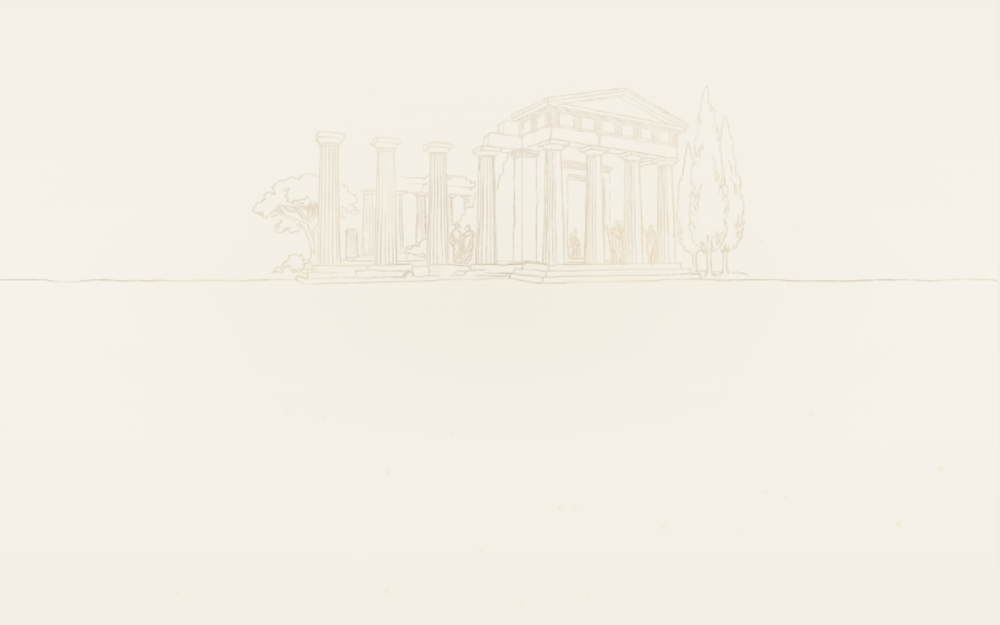 | 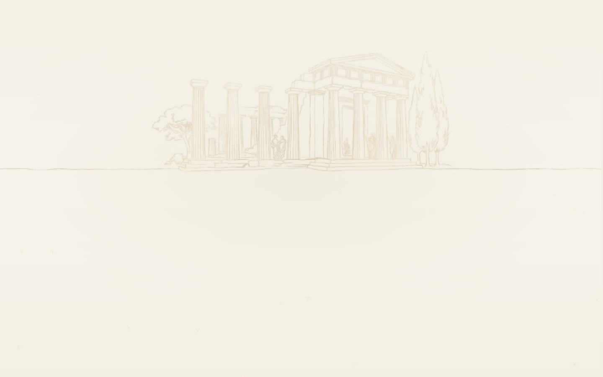 |

*The landing hero in Parchment. Before: a near-black ellipse over cream paper, with the hero letter at 1.95:1.*

| قبل | بعد |
|---|---|
| 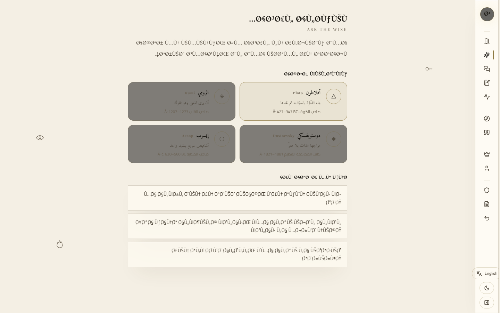 | 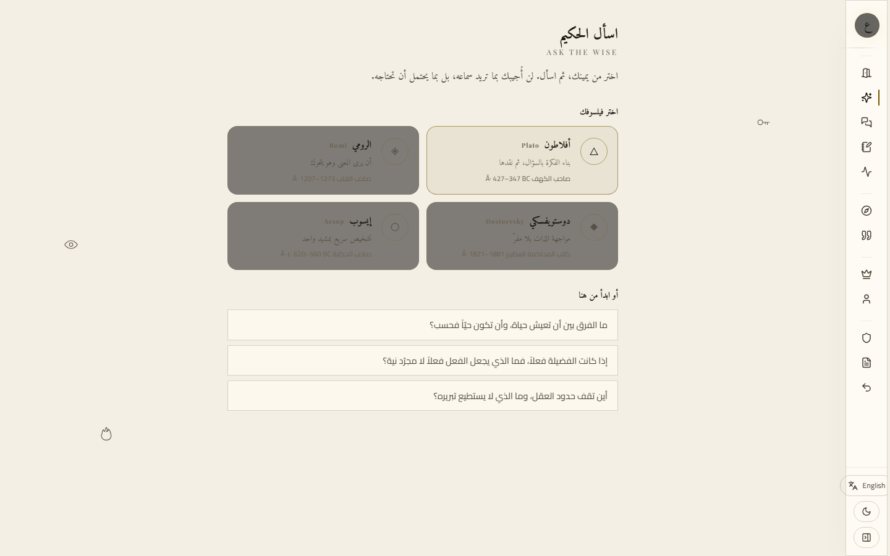 |

*The wisdom panel in Parchment. Before: the philosopher's Latin name, the dates and the Arabic description, all at 1.48:1–2.03:1.*

### P1 — زر إعادة الفحص كان يرمي استثناءً قاتلاً

**The re-check button threw an uncaught exception**  `null-user-crash:/account`

- **السبب:** AccountPanel called isEmailVerified(a!.currentUser!) — two non-null assertions on a value that is null whenever no one is signed in, and also null when Firebase is not configured at all. Inside isEmailVerified, the missing null check turned into a two-step failure that read like a network problem: user.reload() threw a TypeError, the catch swallowed it, and the exception that actually escaped was the user.emailVerified read on the line *after*. The swallow made a missing user look like a failed reload.
- **ما تغيّر:** isEmailVerified now accepts User | null | undefined and returns false for a missing user, which is the honest answer to the question the caller is asking, and the caller drops both assertions. The reload failure is still swallowed, on purpose, because a stale cached answer beats an unhandled rejection.
- **الأثر:** Clicking the verification re-check button on /account raised a page error and left the panel unchanged. Because the button's label was itself mojibake at the time, the finding id was unreadable too — which is how this and the copy corruption turned out to be the same investigation.
- **حارس العودة:** The crawler's interaction pass clicks every control and records page errors, so any future throw on a click reappears as a finding. The TypeError was not reproducible in a unit test because the argument's type said it could not be null.
- **مؤشّر العودة في الفحص:** `click-console-error:` — لم يظهر

| قبل | بعد |
|---|---|
|  |  |

*The account panel before and after. The visual change is the button label: it was corrupted, and in the before frame it is a run of Latin-1 letters.*

### P1 — طلب معلّق في كل صفحة لزائر غير مسجّل

**A hung request on every page for an anonymous visitor**  `unread-response-body:AppShell`

- **السبب:** AppShell fired void fetch("/api/ai").catch(() => undefined) on every page for an anonymous visitor and never read the response body. An unread body keeps the loader alive: the browser holds the connection open indefinitely and never reuses it. Playwright's requestfinished never fired for that URL, 25 seconds after load, which is how it was found.
- **ما تغيّر:** The body is now cancelled explicitly, and the request carries an AbortSignal so it is released if the component unmounts. The call exists only to make the server set the signed miab-anon cookie, so discarding the payload is correct; discarding it without releasing the stream was the defect.
- **الأثر:** One permanently-held connection per anonymous page view. It also made the audit's own readiness wait unreachable, which is how it surfaced: the instrument was failing for a reason that was not the instrument.
- **حارس العودة:** scripts/audit/crawl.ts waits on html[data-hydrated] rather than networkidle, so a long-lived connection can no longer be mistaken for a slow page.
- **مؤشّر العودة في الفحص:** لا يوجد — هذا العيب لم يظهر كعيب في التقرير بل كعطل في أداة الفحص نفسها، وحارسه هو طريقة انتظار الجاهزية لا معرّف عيب.
