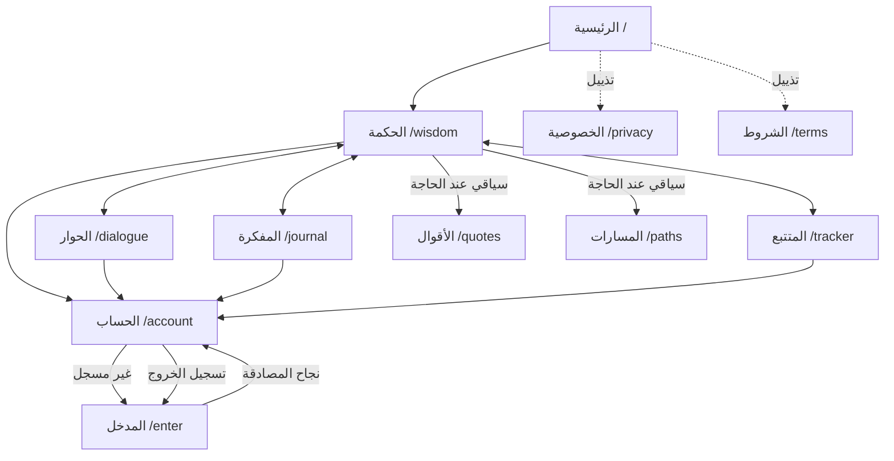

# MASTER_PLAN — عقل في صندوق | Mind in a Box

## أساس الخطة

هذه خطة تنفيذ مرحلية مبنية على نتائج `AUDIT.md` الموجود في المستودع، لا على افتراض أن كل ما ورد فيه ما زال عطلًا حيًا. يسجل التدقيق عيوبًا مؤكدة `[V]` وأخرى منقولة تحتاج إعادة تحقق `[R]`؛ يُعاد اختبار كل بند قبل إصلاحه وبعده. لم أجرِ تصفحًا حيًا لمنتجات المقارنة في هذه الجلسة؛ جدول المرجعية يستخلص أنماطًا عامة من معرفة المنتج، ولا ينقل نصوصًا أو تخطيطات أو أصولًا خاصة.

الأولوية: حماية البيانات وإصلاح أعطال P0/P1، ثم تثبيت التنقل والمصادقة، ثم بناء التجربة البصرية، ثم تحسين الأداء والإطلاق. كل الجهود أدناه تقديرات تخطيطية بأيام مهندس، وليست وعودًا زمنية أو نتائج قياس.

**أدلة المستودع التي تضبط القرارات:** `AUDIT.md` يسجل عيوب التسجيل في `src/lib/auth/client.ts`، وبث الحوار في `src/components/Dialogue.tsx`، وعداد الاستخدام في `src/lib/quota.ts`، وقواعد Firestore في `firestore.rules`، ومزامنة المفكرة في `src/lib/journal/store.ts`، وملاحظات الوصول والأداء والنصوص والأمان. المشروع الفعلي Next.js 14 App Router، وليس تطبيقًا مبنيًا على bundler منفصل؛ صفحات المسارات في `src/app/`، وغلاف المنتج في `src/components/Shell.tsx` و`src/components/ShellChrome.tsx` و`src/components/AppShell.tsx`، والتصميم في `src/app/globals.css`.

## 1. جدول المرجعية

الجدول يضم 44 نمطًا قابلًا للنقل. «التطبيق» توصية تنفيذية لهذا المنتج تحديدًا؛ لا يعني وجود النمط حاليًا أو أن المنتج المرجعي هو الخيار الوحيد.

### أ. التأمل والعادات والتدوين

| المنتج / النمط | ماذا يفعل | لماذا ينجح | تطبيقه في عقل في صندوق |
|---|---|---|---|
| Calm — جلسة واحدة بارزة | يضع جلسة قصيرة واضحة بدل عرض كتالوج كامل | يقلل حيرة البداية ويجعل القيمة قابلة للتجربة فورًا | اجعل أول إجراء في الحكمة سؤالًا واحدًا مقترحًا وزر بدء واحدًا، من دون ألغاز أو طبقات متراكبة. |
| Calm — مشهد هادئ قليل التنافس | يستخدم صورة وصوتًا ومساحات هادئة | يخفض الحمل البصري قبل نشاط يتطلب انتباهًا | استخدم خلفية ثابتة منخفضة التفاصيل خلف القراءة، وأوقف أي حركة زخرفية عند فتح المحادثة. |
| Calm — جلسات محددة المدة | يوضح للمستخدم حجم الالتزام | التوقع الزمني الواضح يزيد احتمال البدء والإكمال | أظهر زمن قراءة/جلسة تقديريًا فقط حين يكون محسوبًا من المحتوى، ولا تصنع عدادًا متوترًا. |
| Headspace — إرشاد مرئي بسيط | يشرح الحالة برسوم وأشكال ودودة | يحول المفاهيم المجردة إلى إشارات سهلة المسح | استعمل أيقونات موحدة وعناوين فعلية لحالات الحكمة والحوار، لا شخصيات أو رسومًا تقلد أسلوبه. |
| Headspace — مسارات متدرجة | يقسم الممارسة إلى خطوات صغيرة | يوضح التقدم من دون الحاجة إلى تعليمات طويلة | قدّم اختيار الفيلسوف ثم السؤال ثم التأمل كتسلسل مفهوم، مع إمكان تخطي أي خطوة. |
| Headspace — نبرة مشجعة غير عقابية | يصوغ التذكير بلا لوم | يقلل شعور الفشل عند الانقطاع | اجعل رسائل تفويت العادة محايدة، ولا تستخدم لغة سلسلة مكسورة أو خسارة تقدم. |
| Day One — الكتابة أولًا | يجعل مساحة الكتابة مركز الصفحة | يضع المهمة الأساسية قبل الأدوات الثانوية | في المفكرة، اجعل محرر اليوم أول عنصر عملي، وأخفِ التصدير والإعدادات في أدوات ثانوية. |
| Day One — تاريخ زمني قابل للبحث | ينظم الإدخالات حسب اليوم | يساعد العودة إلى سجل شخصي طويل | اربط قائمة الأيام بتاريخ محلي واضح، واختبر مناطق الوقت ومفاتيح الأيام قبل تغيير بنية التخزين. |
| Day One — الخصوصية داخل فعل الكتابة | يطمئن المستخدم عند نقطة جمع بياناته | الشفافية قرب الفعل أوضح من سياسة بعيدة | اشرح محليًا/سحابيًا أين تحفظ كل مدخلة، مع بيان صريح لحدود قراءة الإدارة المذكورة في سياسة الخصوصية. |
| Stoic — قالب يومي موجه | يبدأ بأسئلة أو أقسام تأمل محددة | يساعد من لا يعرف كيف يبدأ من دون إجابة نيابة عنه | استخدم قوالب المفكرة الموجودة كدعوات قصيرة، مع خيار كتابة حرة وحفظ تلقائي ظاهر الحالة. |
| Stoic — مراجعة تقدم مفهومة | يعرض سجل الممارسة في مؤشرات بسيطة | يحول العودة إلى العادة إلى ملاحظة لا إلى منافسة | اعرض للمستخدم اتجاهًا أسبوعيًا مشتقًا من بياناته فقط، واشرح طريقة الحساب بجانب المؤشر. |
| Stoic — روتين صباح/مساء | يقسم الممارسة حسب سياق اليوم | يربط المهمة بلحظة استخدام مألوفة | وفّر تمييزًا بين إدخال الصباح والمساء داخل المفكرة، من دون فرض إشعارات أو توقيت افتراضي. |
| Readwise — مراجعة متباعدة | يعيد العناصر المحفوظة في وقت لاحق | يعزز التذكر بدل تراكم محفوظات لا تُفتح | أضف إلى الحوار رابطًا لاستعادة سؤال سابق أو اقتباس حفظه المستخدم، مع تحكم محلي بالتكرار. |
| Readwise — استيراد وتصدير واضحان | يسمح بنقل المكتبة بين الأدوات | يقلل تكلفة ترك المنتج ويعزز الثقة | اجعل تصدير المفكرة بصيغة قابلة للقراءة متاحًا، واختبره على مكتبة كبيرة قبل أي إعادة هيكلة. |
| Readwise — بحث موحد | يبحث في مواد من مصادر مختلفة | يقلل زمن العثور على فكرة سابقة | ابدأ ببحث محلي في إدخالات المستخدم والحوارات المحفوظة، ولا ترفع محتواه إلى خدمة خارجية بلا موافقة. |

### ب. المنتجات المصقولة هندسيًا

| المنتج / النمط | ماذا يفعل | لماذا ينجح | تطبيقه في عقل في صندوق |
|---|---|---|---|
| Linear — اختصارات قابلة للتذكر | يتيح تنفيذ العمل بلوحة المفاتيح | يقلل التنقل المتكرر للمستخدم المتقدم | اجعل اختصارات الحوار والمفكرة اختيارية، مع كشفها في تلميح وإمكانية تعطيلها لقارئ الشاشة. |
| Linear — حالات كيان واضحة | يميز الحالة الحالية عن الإجراء التالي | يقلل الغموض في الأدوات المعقدة | عرّف حالات الرسالة والحفظ والمزامنة والاتصال كقيم ظاهرة ومترجمة، واختبر كل انتقال. |
| Stripe — توثيق قرب الإعداد | يشرح المتطلبات عند موضع الإعداد | يحول الإعداد إلى قائمة قابلة للتحقق | اربط حارس الإنتاج بأسماء متغيرات البيئة الناقصة في سجلات CI الخاصة، ولا تعرضها للزائر. |
| Stripe — رسائل خطأ قابلة للإصلاح | تفرق بين سبب الخطأ والخطوة التالية | تقلل التخمين والدعم المتكرر | اربط أخطاء Firebase ومزود الذكاء الاصطناعي بنص مستخدم موجز وإجراء آمن، مع تفاصيل تقنية في السجل فقط. |
| Vercel — نشر ومعاينة متمايزان | يفصل بيئات المعاينة عن الإنتاج | يمنع اختبار تغيير غير مكتمل على جمهور الإنتاج | اجعل نشر المعاينة بوابة إلزامية لاختبارات Pages وCSP والمتغيرات قبل ترقية الإصدار. |
| Vercel — سجلات قابلة للربط بالطلب | يربط الفشل بسجل تنفيذ محدد | يقصر زمن عزل العطل | أضف معرّف طلب منقحًا بين المتصفح وCloudflare Function وسجل المزود، من دون تسجيل نصوص خاصة. |
| Notion — بنية مرنة لكن مرئية | يجمع المحتوى في صفحات وعناصر قابلة للتركيب | يناسب أنماط عمل مختلفة دون واجهة مزدحمة | احتفظ بأقسام المفكرة قابلة للطي، لكن اعرض الحالة والقسم النشط بوضوح على شاشة الهاتف. |
| Notion — مزامنة بحالة مفهومة | يميز المحفوظ محليًا عن المتزامن | يقلل القلق من ضياع العمل | أظهر شارة «على هذا الجهاز/تمت المزامنة/تعذر الاتصال» وفق نتيجة فعلية من `src/lib/journal/store.ts`. |
| Arc — تقليل العناصر الدائمة | يخفي الأدوات قليلة الاستخدام حتى الحاجة | يوسع مساحة المحتوى ويقلل الضجيج | أزل قائمة المزيد كطبقة تنقل عامة، وانقل الخصوصية والشروط إلى تذييل صغير ثابت. |
| Arc — سياق بدل ازدحام التبويبات | يبقي المهمة الحالية في المقدمة | يقلل كلفة التبديل | لا تعرض اقتباسات ومسارات وعضويات كوجهات متساوية مع الحوار؛ اربطها سياقيًا عند الحاجة. |
| Raycast — أمر موحد سريع | يجمع الأوامر في مدخل واحد | يسرع المستخدم الذي يعرف مقصدَه | أضف لاحقًا بحث أو قائمة أوامر صغيرة للتنقل، بعد اكتمال شريط الوجهات الخمس وإتاحة لوحة المفاتيح. |
| Raycast — تأكيد الإجراء مباشرة | يعطي نتيجة قصيرة بعد الأمر | يثبت أن التفاعل نجح | أظهر تأكيدًا حيًا بعد الحفظ أو النسخ أو اختيار الفيلسوف عبر `aria-live` غير مزعج. |
| Superhuman — صندوق وارد قليل التشتيت | يقدم مجموعة صغيرة من الأفعال الأساسية | يوجه الانتباه إلى قرار واحد | اجعل زر الإرسال والإيقاف هما الفعلين الأوضح في المحادثة، وانقل إعدادات النموذج خارج مساحة القراءة. |
| Superhuman — إكمال لحظي للمهمة | يقلل الفاصل بين الفعل والتغذية الراجعة | يحافظ على الإيقاع الذهني | اعرض أول جزء من استجابة النموذج عند وصوله، بعد إصلاح `onDelta` في `WisdomChat.tsx`، ولا توحِ بالبث إذا كان النص لا يظهر. |

### ج. واجهات المحادثة

| المنتج / النمط | ماذا يفعل | لماذا ينجح | تطبيقه في عقل في صندوق |
|---|---|---|---|
| Claude — منطقة قراءة هادئة | يعطي نص الإجابة العرض الأكبر | المحادثة الطويلة تحتاج تسلسلًا بصريًا | وسّع عمود النص وحدد طول السطر، واجعل زخرفة الخلفية غير منافسة للكتابة. |
| Claude — وثائق طويلة قابلة للتصفح | يدعم إجابات منظمة بعناوين | يسهل العودة إلى موضع داخل إجابة كبيرة | اعرض رد الفيلسوف بعناوين وقوائم سليمة، واختبر بنية Markdown ومستويات العناوين. |
| Claude — صوت متحفظ | لا يبالغ في الوعود أو الزينة | يلائم سياق التفكير والموضوعات الحساسة | قدّم الفلاسفة كعدسات حوارية لا كتقمص حرفي أو سلطة علاجية، واظهر حدود الذكاء الاصطناعي. |
| ChatGPT — بث قابل للإيقاف | يبدأ الرد مبكرًا ويتيح الإيقاف | يقلل الإحساس بالانتظار ويمنح المستخدم سيطرة | أصلح إدارة معرّف الجولة في `Dialogue.tsx`، واربط إيقاف الواجهة بـ`AbortSignal` حتى upstream. |
| ChatGPT — محادثات قابلة للاستعادة | يحتفظ بسياق المستخدم السابق | يقلل إعادة شرح الموضوع | اربط سجل الحوار بمزامنة المستخدم الحالية، واختبر الحذف محليًا وبعيدًا معًا. |
| ChatGPT — مؤشر حالة واضح | يميز التفكير والكتابة والفشل | يفسر الصمت ويمنع الإرسال المكرر | عرّف حالات انتظار أول رمز، والبث، والإلغاء، وفشل المزود في reducer واحد. |
| Perplexity — مصادر منفصلة عن الاستنتاج | يميز الدليل عن الإجابة | يسهل التحقق من المعرفة المعلنة | عند إظهار اقتباس أو إحالة، افصل نص الاقتباس ومصدره عن تأمل الفيلسوف، ولا تختلق توثيقًا. |
| Perplexity — أسئلة متابعة سياقية | يقترح متابعة مبنية على الحوار | يقلل كلفة صياغة الدور التالي | اقترح متابعة واحدة مشتقة من الرد، ولا تدرجها تلقائيًا في الرسالة أو تستهلك محاولة قبل النقر. |
| Perplexity — تفاعل مرئي مع الأدلة | يجعل فتح المرجع فعلًا مباشرًا | ينقل القارئ من النتيجة إلى التحقق | اجعل روابط المصادر خارجية آمنة وموسومة، بعد تنظيف URL والتحقق من النطاق. |

### د. المحتوى الفكري

| المنتج / النمط | ماذا يفعل | لماذا ينجح | تطبيقه في عقل في صندوق |
|---|---|---|---|
| Medium — إيقاع قراءة طويل | يحد من العرض ويعطي النص مساحة | يقلل إجهاد المسح الأفقي | حدد عرض قراءة عربيًا مريحًا وتباعدًا رأسيًا ثابتًا للمقالات والردود. |
| Medium — تقدير القراءة | يقدم توقعًا قبل فتح النص | يساعد الاختيار دون مقاطعة | أظهر تقديرًا محسوبًا للمحتوى الطويل فقط، ولا تستخدمه كعداد تنافسي. |
| Substack — الكاتب وسياق النص | يوضح صاحب المحتوى ومناسبته | يبني الثقة حول الكلام المنشور | افصل اسم الفيلسوف عن هوية المنتج، وعرّف كل شخصية بإيجاز دون الادعاء أن النص تاريخي أصيل. |
| Substack — اشتراك غير مشتت | يجعل العودة للمحتوى فعلًا مقصودًا | يحترم انتباه القارئ | لا تضف طلب بريد أو اشتراكًا تسويقيًا للخطة؛ وفّر حفظًا محليًا اختياريًا داخل المنتج الحالي. |
| Are.na — مجموعات مرئية مترابطة | ينظم عناصر الفكر في مجموعات | يدعم الاكتشاف غير الخطي | اربط الاقتباس المحفوظ بالسؤال أو المفكرة ذات الصلة مع عرض المصدر وتاريخ الحفظ. |
| Are.na — اكتشاف هادئ بلا ترتيب شعبية | يركز على العلاقات لا المقاييس الاجتماعية | يحافظ على غرض التأمل بدل المنافسة | لا تضف إعجابات أو لوحات ترتيب؛ اجعل الاكتشاف عبر موضوع أو فيلسوف أو سؤال محفوظ. |

## 2. الاتجاه الفني

| الاتجاه | الألوان المقترحة | الخطوط العربية | الحركة | نبرة الصورة والمثال الوصفي |
|---|---|---|---|---|
| أ. الرواق الحجري الليلي | خلفية `#151817`، سطح `#202522`، نص `#F0EBDD`، نص ثانوي `#C7C1B4`، نحاس هادئ `#B39562`، أخضر حجري `#68796A` | Cairo للواجهة وAmiri للنصوص التأملية، مع Playfair Display للاتينية؛ وهي عائلات مسجلة حاليًا في `src/app/layout.tsx` | انتقالات 120–180ms، ظهور موضعي قصير، لا جسيمات متحركة في صفحات القراءة، احترام `prefers-reduced-motion` | صفحة كأنها رواق ليلي مضاء بمصباح جانبي، كتلة نصية واضحة وصورة حجرية خافتة لا تحجب القراءة. |
| ب. دفتر الفجر الورقي | خلفية `#F6F3EA`، سطح `#FFFEFA`، نص `#27332F`، نص ثانوي `#56635B`، أخضر زيتوني `#58705A`، طين `#A95F47` كإشارة محدودة | Cairo أو Noto Sans Arabic للواجهة، Amiri أو Noto Naskh Arabic للنص الطويل؛ إبقاء Playfair Display للاتينية فقط | حركة وظيفية قصيرة 100–160ms، انتقالات بين الصفحات بلا parallax، تعطيل الزينة الحركية في وضع تقليل الحركة | دفتر فاتح مفتوح على ورق طبيعي، خط عربي كبير، فواصل دقيقة، وأثر معماري نباتي خفيف عند الأطراف. |

**الاختيار: دفتر الفجر الورقي كالوضع الافتراضي، مع إبقاء الوضع الداكن اختيارًا محفوظًا.**

1. خلفية فاتحة محايدة ترفع قابلية قراءة صفحات المفكرة والسياسات والحوارات الطويلة على الهاتف، بدل جعل كل الجلسة كتلة سوداء.
2. تباين النصوص يمكن ضبطه وقياسه بعلاقة واضحة بين الخلفية والنص؛ وهذا يعالج فئة مخالفات التباين التي سجلها `AUDIT.md` بدل الاعتماد على لون ذهبي زخرفي للنص.
3. الخطان Cairo وAmiri مسجلان بالفعل، لذلك لا يحتاج الاتجاه المختار إلى تنزيل حزم خطوط جديدة أو توسيع الحزمة.
4. اختلاف العربية واللاتينية يعالج بتحديد `lang` و`dir` على المقاطع اللاتينية، وهو علاج مباشر لملاحظات `PersonaCards.tsx` و`LegalDocument.tsx`.
5. اللون الطيني أو الزيتي يمكن أن يميز حالة الفعل من دون أن ينافس النص؛ ويظل الذهبي الحالي تفصيلًا محدودًا لا لونًا لكل عنصر.

تبقى قيم هذا القسم اتجاهًا تصميميًا مقترحًا، وليست مواصفة نهائية: تُراجع عينات اللون على OLED وشاشات LCD، ويجب اجتياز `scripts/verify-contrast.mjs` لكل زوج نص/سطح قبل اعتمادها.

## 3. معمارية المعلومات

### التنقل النهائي

الوجهات الأساسية الخمس وبالترتيب: **الحكمة، الحوار، المفكرة، المتتبع، الحساب**. تظهر كلها مباشرة في شريط الهاتف؛ وعلى سطح المكتب تظهر في سكة تنقل واضحة أو شريط أفقي، من دون نسخة مصغرة تخفي وظائف أساسية. «الحساب» يفتح `src/app/account/page.tsx` للمستخدم المسجل، ويوجه غير المسجل إلى `src/app/enter/page.tsx`.

**مصير «المزيد»:** حذف زر وورقة «المزيد» من التنقل اليومي بعد نقل الروابط القانونية إلى التذييل وتوفير مسارات سياقية لبقية الصفحات. لا تُحذف صفحات `/quotes` و`/paths` أو روابطها العميقة في المرحلة نفسها؛ تبقى قابلة للوصول من موضع سياقي مناسب إلى أن تؤكد تحليلات الاستخدام ومالكية المحتوى مصيرها. صفحات العضوية والأسعار والاسترداد لا تدخل التنقل الجديد ولا تُضاف لها عروض؛ تُحفظ الروابط الحالية مؤقتًا إلى أن يقرر مالك المنتج مصيرها.

**الألغاز:** إزالة طبقة اللغز المرئية والمنطق المرتبط بها بالكامل على مراحل، لكن لا حذف لسجلات `puzzles` أو مفاتيح التخزين قبل جردها وتصدير نسخة احتياطية وتجربة ترحيل قابلة للعكس.

**الخصوصية والشروط:** تبقيان صفحتين مستقلتين ونظيفتين (`/privacy` و`/terms`) بمحتواهما القانوني، وتُنقل روابطهما فقط إلى تذييل صغير. لا يُنقل نص السياسة إلى نافذة منبثقة ولا يُحذف الإفصاح الحالي عن مجموعات Firestore القديمة.

### مخطط الروابط

يجب أن تعمل كل الروابط العميقة والعودة بعد تسجيل الدخول، وأن تكون وجهة التنقل النشطة معلنة لقارئ الشاشة. لا تكون `/quotes` أو `/paths` ضمن شريط الوجهات الخمس حتى لو بقيت الصفحتان.

## 4. المراحل التسع

### المرحلة 1 — التنظيف والحذف

- **الهدف:** جرد الألغاز وحذف ظهورها ومساراتها وواجهاتها بعد تأمين بيانات المستخدمين؛ تنظيف النصوص والروابط التي أصبحت يتيمة. إصلاح P0/P1 المؤكدة التي تمنع الكتابة أو تحرفها قبل واجهة جديدة.
- **الملفات المتأثرة من الشجرة الفعلية:** `src/components/GoldenSymbols.tsx`، `src/components/riddle/GoldenToken.tsx`، `src/components/riddle/RiddleSession.tsx`، `src/components/ShellChrome.tsx`، `src/components/AppShell.tsx`، `src/lib/riddle/`، `src/app/api/riddle/`، `src/lib/store.ts`، `src/lib/firebase/client.ts`، `src/lib/firebase.ts`، `firestore.rules`، `src/app/privacy/page.tsx`، `src/app/sitemap.ts`، `e2e/riddle.spec.ts`، اختبارات `tests/` ذات الصلة. بعض ملفات الألغاز قد تزال؛ لا تُحذف حتى يكتمل جرد الاستيراد والبيانات.
- **اعتماديات:** لا اعتماد على واجهة جديدة؛ يلزم قبل الإزالة جرد حقول التخزين الفعلية ومراجعة سياسة الاحتفاظ والقيود القانونية.
- **المخاطر:** فقد سجلات محلية أو Firestore؛ بقاء مدخل إلى API بعد إزالة الواجهة؛ حذف رمز يمنح استحقاقًا أو محتوى مستخدمًا؛ كسر إعدادات persist عند تغيير شكل المتجر.
- **خطوات التراجع:** نسخة احتياطية مؤرخة ومشفرة من `users/{uid}/puzzles` ومن مفاتيح التخزين المحلي المتأثرة، نسخة تصدير من قواعد Firestore، وحفظ الإصدار السابق؛ تشغيل الترحيل أولًا في وضع dry-run ثم emulator/staging. احتفظ بسجلات puzzle القديمة مؤقتًا أو أرشفها؛ لا تحذفها نهائيًا ضمن نشر الواجهة. اجعل ترحيل localStorage ذا رقم إصدار وخطوة استعادة موثقة.
- **اكتملت عندما:** لا تظهر رموز أو حوارات ألغاز في أي مسار؛ لا توجد روابط أو imports أو عناصر sitemap إلى مسارات أزيلت؛ اختبارات البحث/التوجيه تؤكد ذلك؛ تصدير واستعادة نسخة الاختبار ينجحان؛ ولا توجد قراءة/كتابة Firestore مرفوضة جديدة.

### المرحلة 2 — نظام التصميم

- **الهدف:** اعتماد دفتر الفجر الورقي مع الوضع الداكن الاختياري، توحيد ألوان التوكنات، مقياس النص العربي، المسافات، التركيز، حالات الحفظ، والأرقام والاتجاه.
- **الملفات المتأثرة:** `src/app/globals.css`، `src/components/ThemeProvider.tsx`، `src/components/ThemeColorUpdater.tsx`، `src/app/layout.tsx`، `tailwind.config.ts`، `scripts/verify-contrast.mjs`، وواجهات `src/components/` التي يثبت تدقيقها مخالفة.
- **اعتماديات:** المرحلة 1، ومخرجات اختبار المتصفح كأساس مقارنة قبل أي تغيير لوني.
- **المخاطر:** تراجع التباين أو وميض الثيم عند hydration؛ تحويل واسع يغير صور الصفحات؛ قطع نص عربي أو سوء bidi.
- **خطوات التراجع:** حفظ قيم التوكنات السابقة في commit منفصل، إبقاء مفاتيح التوكنات الدلالية نفسها، وإرجاع theme mapping دون المساس ببيانات المستخدم أو إعداداته.
- **اكتملت عندما:** فحص التباين الآلي ينجح 100% للزوجين الفاتح والداكن، لا توجد مخالفة تباين axe في المسارات الأساسية، ولا يحدث وميض اتجاه/ثيم في تحميل بارد، وتنجح مراجعة النصوص العربية واللاتينية على 360 و390 و768 و1280 و1920 بكسل.

### المرحلة 3 — إطار التطبيق والتنقل

- **الهدف:** تثبيت الوجهات الخمس، إزالة «المزيد»، إضافة روابط الخصوصية والشروط في التذييل، وضبط مسارات العودة وروابط الصفحات الثانوية.
- **الملفات المتأثرة:** `src/lib/nav.ts`، `src/components/Shell.tsx`، `src/components/ShellChrome.tsx`، `src/components/Sidebar.tsx`، `src/components/Shortcuts.tsx`، `src/components/AppShell.tsx`، `src/app/layout.tsx`، `src/app/sitemap.ts`، `src/app/robots.ts`، `e2e/shell.spec.ts`.
- **اعتماديات:** المرحلة 1 و2؛ يجب أن تكون مقاييس الوجهات الخمس معروفة قبل نقل رابط.
- **المخاطر:** مسارات عميقة يتيمة أو إعادة توجيه تكسر bookmark؛ اختفاء زر غير قابل للوصول بلوحة المفاتيح؛ تعارض حالة تسجيل الدخول مع وجهة الحساب.
- **خطوات التراجع:** أبقِ `href` القديم للصفحات الثانوية، أعد عنصر التنقل من قائمة ثابتة قابلة للرجوع، ولا تحذف الصفحات أو sitemap entries قبل قياس أثرها ومراجعة SEO.
- **اكتملت عندما:** تظهر الوجهات الخمس نفسها في الهاتف وسطح المكتب؛ لا يظهر عنصر «المزيد»؛ الخصوصية والشروط قابلتان للوصول من التذييل؛ جميع الروابط العميقة تعيد 200 أو تحويلًا مقصودًا موثقًا؛ واختبار لوحة المفاتيح ينجح من كل وجهة.

### المرحلة 4 — المصادقة

- **الهدف:** إصلاح تعطّل الدخول والتسجيل، وإظهار سبب تقني مفيد في سجلات المطور لا في واجهة الزائر، وتثبيت إعداد Firebase وTurnstile في بيئات Pages.
- **الملفات المتأثرة:** `src/components/AuthPanel.tsx`، `src/components/Turnstile.tsx`، `src/lib/auth/client.ts`، `src/lib/auth/server.ts`، `src/lib/firebase/config.ts`، `src/lib/firebase/client.ts`، `src/lib/firebase/FirebaseRequired.tsx`، `src/lib/env.ts`، `scripts/check-env.mjs`، `firestore.rules`، `src/app/api/auth/turnstile/route.ts`، `src/app/account/page.tsx`، `src/app/enter/page.tsx`، اختبارات `src/lib/auth/*.test.ts` و`e2e/firebase-config.spec.ts`.
- **اعتماديات:** المرحلة 1 لاستخراج ألغاز المصادقة عن الألغاز؛ المرحلة 3 لتحديد رحلة `/account` و`/enter`.
- **المخاطر:** إنشاء الحساب ثم الفشل عند تحديث الاسم؛ مفاتيح عامة مفقودة وقت البناء؛ خلط قيم preview وproduction؛ سر إداري أو خدمة في متغير عام؛ حارس البيئة لا يرفض نشرًا مكسورًا.
- **خطوات التراجع:** لا تمسح حسابات ولا تعِد إنشاءها. احتفظ بإصدار واجهة الدخول السابق، واختبر إنشاء الحساب والترقية كضيف على Firebase emulator ومشروع staging؛ يمكن إرجاع الواجهة دون تغيير مستندات المستخدم. لا تُدوّر service account إلا ضمن إجراء مستقل مع استعادة مجربة.
- **اكتملت عندما:** ينجح دخول/خروج/إنشاء/استعادة كلمة المرور وترقية الضيف في e2e؛ تتطابق `authDomain` و`projectId` مع مشروع Firebase المقصود؛ يمنع `check-env` النشر عند نقص أي متطلب إنتاج؛ وتُحجب كل قيمة سرية من حزمة المتصفح والسجلات.

### المرحلة 5 — الصفحة الرئيسية

- **الهدف:** جعل الصفحة بوابة مباشرة إلى قيمة المنتج: تعريف موجز بالمنهج ثم انتقال واحد واضح إلى الحكمة، بلا وحدات تجارية أو ألغاز.
- **الملفات المتأثرة:** `src/app/page.tsx`، `src/components/UtopiaHero.tsx`، `src/components/Logo.tsx`، `src/components/GreekColumns.tsx`، `src/components/GoldDust.tsx`، `src/lib/seo.ts`، `e2e/shell.spec.ts`.
- **اعتماديات:** المرحلتان 2 و3؛ تستخدم ألوان وخطوط التوكنات والتنقل النهائي.
- **المخاطر:** تعارض landmarks أو CSP مع script metadata؛ أثر بصري كبير على LCP؛ وعد لغوي يوحي بأن الذكاء فيلسوف حقيقي.
- **خطوات التراجع:** إبقاء نصوص metadata الحالية وخيار إرجاع hero السابق مستقلًا عن التنقل، واختبار CSP/JSON-LD على preview قبل النشر.
- **اكتملت عندما:** ينجح الزائر في الوصول للحكمة بإجراء واحد، الصفحة صالحة للهاتف والسطح المكتبي بلا تمرير أفقي، علامة H1 واحدة وlandmark رئيسي واحد، ونتائج LCP ضمن أهداف القسم 5.

### المرحلة 6 — الخلفيات والأجواء

- **الهدف:** استخدام الأصول الموجودة باعتدال، وتثبيت الخلفية بحيث لا تزاحم النص أو تسبب تحميلًا وتحركًا غير لازم.
- **الملفات المتأثرة:** `src/components/art/ArtLayer.tsx`، `src/components/GreekColumns.tsx`، `src/components/GoldDust.tsx`، `src/app/globals.css`، `public/art/`، `public/art/art-manifest.json`، `scripts/build-art.mjs`، `scripts/process-images.mjs`.
- **اعتماديات:** المرحلة 2؛ لا يبدأ تحسين الصورة قبل تثبيت الألوان ومساحة القراءة.
- **المخاطر:** تحميل AVIF كبير أو نسخة غير مناسبة للمقاس؛ وميض/CLS عند ظهور الصورة؛ parallax يضر reduced-motion؛ كشف بيانات metadata غير لازمة.
- **خطوات التراجع:** احتفظ بmanifest وإصدارات الأصول الحالية، واستخدم fallback لوني ثابتًا مع كل صورة. تبديل أصل واحد في كل مرة، مع إمكانية إعادة manifest السابق.
- **اكتملت عندما:** تُحمّل نسخة الصورة المتوافقة مع المقاس، لا يسبب ظهور الخلفية CLS أعلى من 0.02، لا تتجاوز الخلفية محتوى النص أو تباينه، ولا توجد حركة عند تفعيل تقليل الحركة.

### المرحلة 7 — الحكمة والحوار

- **الهدف:** إصلاح البث وإدارة الجولات والأخطاء، وتحسين اختيار الشخصيات، وحدّ الاستخدام وتجربة الإلغاء مع الإفصاح عن كون الرد مولدًا.
- **الملفات المتأثرة:** `src/components/WisdomChat.tsx`، `src/components/Dialogue.tsx`، `src/components/PersonaCards.tsx`، `src/components/GateDialog.tsx`، `src/components/QuotaMeter.tsx`، `src/lib/ai.ts`، `src/lib/ai/`، `src/lib/quota.ts`، `src/app/api/ai/route.ts`، `src/app/api/dialogue/route.ts`، `src/lib/auth/server.ts`، `e2e/wisdom.spec.ts`، `e2e/dialogue.spec.ts`، `scripts/fake-upstream.mjs`.
- **اعتماديات:** المرحلة 4 للمصادقة والبيئة، والمرحلة 3 للتنقل. إصلاح مسارات Firestore للعداد من المرحلة 1/4 قبل الادعاء بأن خمس محاولات مضمونة.
- **المخاطر:** مضاعفة الرسائل أو محو أدوار سابقة؛ استهلاك مجاني غير محدود بسبب مسار Firestore غير صالح؛ تعليق stream بعد قطع الاتصال؛ عرض فشل مزود كأنه جواب؛ توجيه أزمة خاطئ.
- **خطوات التراجع:** استخدام fake upstream في E2E، حد أقصى محافظ للطلبات، تعطيل مزود معطوب عبر إعداد الخادم، والرجوع إلى إصدار واجهة/Function سابق. لا تُصفّر counters ولا تغيّر cookies أو مفاتيح المستخدمين أثناء rollback.
- **اكتملت عندما:** لا تتكرر أو تمحى رسالة عند جولتين متتاليتين؛ يبدأ ظهور النص ضمن 8 ثوانٍ في 95% من اختبارات staging؛ ينتهي الطلب أو يُلغى خلال 30 ثانية كحد أقصى؛ لا تُحسب المحاولة على فشل مزود قبل بدء الإجابة؛ وحدّ الضيف خمس محاولات ينجح في اختبارات التزامن وإعادة التحميل.

### المرحلة 8 — المفكرة والمتتبع

- **الهدف:** ضمان عدم فقد الكتابة أو خلط أيامها، ومزامنة محلية أولًا مفهومة، وضبط صلاحيات Firestore لكل UID.
- **الملفات المتأثرة:** `src/components/Journal.tsx`، `src/components/DailyTracker.tsx`، `src/components/journal/JournalApp.tsx`، `src/components/journal/Charts.tsx`، `src/lib/journal/store.ts`، `src/lib/store.ts`، `src/lib/conversations.ts`، `src/lib/session.ts`، `firestore.rules`، `tests/firestore.rules.test.ts`، `e2e/journal.spec.ts`، `e2e/tracker.spec.ts`.
- **اعتماديات:** المرحلة 4 لتهيئة Firebase والمصادقة، والمرحلتان 2 و3 لحالة الواجهة والتنقل. يجب أن يسبق أي تعديل schema اختبار ترحيل مستقل.
- **المخاطر:** تعارض كتابة offline بين جهازين؛ خطأ منطقة زمنية أو تغيير اليوم؛ رفض قواعد Firestore يبقي طابور المزامنة معلقًا؛ حذف محلي/بعيد غير متناسق؛ صلاحية إدارة أوسع من سياسة الخصوصية.
- **خطوات التراجع:** تصدير snapshot من emulator/staging ونسخة إنتاج وفق إجراءات الوصول المعتمدة قبل schema migration؛ ترحيل مع dry-run وعداد سجلات متأثرة؛ كتابة migration عكسية؛ نشر قواعد متوافقة مع القراءة القديمة أولًا ثم التطبيق ثم تضييق القواعد. لا تنفذ حذفًا جماعيًا إذا لم تتطابق أعداد المصدر والوجهة.
- **اكتملت عندما:** تنجح كتابة/تعديل/حذف في وضع offline ثم online؛ لا تضيع حقول عند تعديل متزامن؛ اختبارات UID تؤكد أن مستخدمًا لا يقرأ أو يكتب سجل مستخدم آخر؛ ولا يبقى heartbeat مرفوض بسبب عدم تطابق مفاتيح القواعد.

### المرحلة 9 — الأداء والجودة والإطلاق

- **الهدف:** إثبات أهداف الأداء والوصول واللغة والأمان على build الإنتاج، وإطلاق تدريجي مع مراقبة قابلة للتراجع.
- **الملفات المتأثرة:** `package.json`، `next.config.mjs`، `playwright.config.ts`، `playwright.live.config.ts`، `vitest.config.ts`، `vitest.rules.config.ts`، `scripts/check-env.mjs`، `scripts/check-edge.mjs`، `scripts/check-headers.mjs`، `scripts/check-content.mjs`، `scripts/check-mojibake.mjs`، `scripts/check-no-keys.mjs`، `scripts/verify-contrast.mjs`، `public/_headers`، `wrangler.toml`، `e2e/`.
- **اعتماديات:** المراحل 1–8. لا بوابة إطلاق تتجاوز فشل قواعد البيانات أو المتغيرات أو اختبار المسارات الحرجة.
- **المخاطر:** الاعتماد على `next dev` بدل production؛ فرق إعداد Preview/Production؛ headers لا تصل فعليًا إلى Pages؛ الاعتماديات الثقيلة أو غير المستخدمة؛ بيانات مراقبة تحتوي نص محادثة.
- **خطوات التراجع:** ترقية Pages تدريجيًا عبر preview ثم production؛ تثبيت رقم إصدار البناء وقواعده؛ إرجاع deployment السابق عبر Cloudflare؛ إبقاء لقطة قواعد Firestore قبل ترقية schema؛ إيقاف المراقبة التي تلتقط المحتوى فورًا إن ظهر تسرب.
- **اكتملت عندما:** اجتياز جميع بوابات الجودة في build production؛ تحقيق الأهداف الكمية في القسم 5؛ وجود سجل مقارنة Lighthouse/axe/صور؛ تجربة rollback على preview موثقة؛ وإطلاق مع مراقبة أخطاء منقحة لا تجمع نصوص المستخدمين.

## 5. مقاييس النجاح

الهدف هو ميزانية قبول مستقبلية، لا وصف للحالة الحالية. `AUDIT.md` لا يسجل درجات Lighthouse أو LCP أو CLS أو INP أو نسبة تغطية E2E أو حدًا زمنيًا لطلب النموذج؛ لذلك لا يصح اختلاق خط أساس لهذه العناصر. يسجل فقط نتيجة build: **87.6 kB First Load JS مشترك** و**232–288 kB First Load JS للصفحات الأثقل**، من دون توثيق إن كانت القيم خامًا أم مضغوطة. لا تقارن هذه مباشرة بميزانية gzip أدناه.

| المقياس | هدف القبول | الحالي الموثق في `AUDIT.md` |
|---|---:|---|
| Lighthouse للهاتف — Performance | ≥ 90 لكل من `/` و`/wisdom` و`/dialogue` | غير مقاس / غير مذكور |
| Lighthouse للهاتف — Accessibility | ≥ 95 | غير مقاس / غير مذكور؛ يسجل التدقيق عيوب وصول وتباين تستلزم إعادة فحص |
| Lighthouse للهاتف — Best Practices | ≥ 95 | غير مقاس / غير مذكور |
| Lighthouse للهاتف — SEO | ≥ 95 | غير مقاس / غير مذكور |
| LCP للهاتف، p75 | ≤ 2.5 ثانية | غير مذكور |
| CLS، p75 | ≤ 0.10 | غير مذكور |
| INP، p75 | ≤ 200ms | غير مذكور؛ INP مقياس ميداني وليس درجة Lighthouse lab مباشرة |
| JavaScript الأولي للهاتف | ≤ 150 kB gzip للمسار الأساسي، بقياس transfer size موحد | 87.6 kB مشترك و232–288 kB First Load JS لأثقل المسارات؛ نوع الحجم/الضغط غير موثق |
| E2E للمسارات الحرجة | 100% من 8 رحلات: دخول/ضيف/حد الاستخدام/حوار/حكمة/مفكرة offline-sync/متتبع/حساب وخروج | لا توجد نسبة تغطية في AUDIT.md؛ توجد مواطن P0/P1 واختبارات E2E بحسب خريطة المشروع |
| زمن طلب الذكاء الاصطناعي | ≤ 30 ثانية حتى نهاية/خطأ/إلغاء، وأول رمز ≤ 8 ثوانٍ في 95% من staging runs | غير مذكور؛ يوجد مسار فشل `timeout_first_token` دون زمن أساس في التقرير |

ينبغي تسجيل Lighthouse بأداة وإصدار وبيئة ثابتة، ثلاث مرات على الأقل لكل جهاز واستخدام الوسيط؛ تسجل قيم المختبر والفيلد منفصلة. لا تُستخدم درجات ماضية من `AUDIT-UI.md` كبديل عن Lighthouse: ذلك تقرير تدقيق واجهة مختلف، بمقاسات وتركيبات مختلفة.

## 6. خطة المخاطر

| الترتيب | الخطر والدليل | الاحتمال / الأثر | الوقاية | التراجع |
|---:|---|---|---|---|
| 1 | فساد أو فقد البيانات عند تغيير شكل المخزن أو حذف الألغاز؛ `src/lib/store.ts` و`src/lib/journal/store.ts` وحقول `users/{uid}/puzzles`، مع خسائر دمج موثقة في التدقيق | متوسط / حرج | قبل أي تغيير schema: جرد مفاتيح localStorage وحقول Firestore، snapshot مؤرخ ومشفر، سكربت ترحيل versioned، dry-run، checksum وعدد سجلات قبل/بعد، تجربة restore على نسخة staging | أوقف ترحيل الكتابة، أعد التطبيق للإصدار السابق، شغّل migration عكسية أو restore من النسخة المحققة؛ لا تحذف المصدر قبل موافقة مطابقة الأعداد |
| 2 | فشل المصادقة بسبب عيب تحديث الملف الشخصي أو إعداد بيئة Firebase؛ `src/lib/auth/client.ts` و`src/lib/firebase/config.ts` | مرتفع / حرج | حالات اختبار منفصلة للدخول والتسجيل وترقية الضيف؛ تحقق build-time من Firebase project/auth domain؛ إعداد المعاينة والإنتاج منفصل | إرجاع auth UI/النسخة السابقة مع الحفاظ على الحسابات؛ إصلاح متغيرات البيئة ثم rebuild، لا تكرر إنشاء الحساب تلقائيًا |
| 3 | استهلاك مجاني يتجاوز خمس محاولات بسبب مسار IP غير صالح/مسار fail-open؛ `src/lib/quota.ts` | متوسط / حرج | اختبار REST path على emulator/Firestore، concurrency test، مراقبة counter failures، منع إطلاق عند غياب secret أو الاعتماد الإداري | تعطيل واجهة طلب جديدة مؤقتًا أو حد بديل محافظ من الخادم؛ لا تصفّر العدادات ولا تعتمد على localStorage كحماية |
| 4 | وصول إداري أو تسريب محتوى قديم؛ `firestore.rules` يسمح ببعض عمليات إدارة `entries`، والسياسة تقر بقدم `entries/events/puzzles` | متوسط / حرج | اختبارات rules لكل UID ودور، مراجعة صلاحيات كل subcollection، تطبيق مبدأ الرفض الافتراضي، توافق نص الخصوصية مع القواعد | إعادة نشر نسخة rules سابقة فقط إن لم توسع الوصول؛ عند كشف حقيقي أوقف المسار المتأثر، احفظ سجلات التدقيق، وأبلغ وفق السياسة القانونية |
| 5 | فقد أو تكرار رسائل الحوار؛ `src/components/Dialogue.tsx` يحدّث حسب `personaId` بدل معرف الجولة | مرتفع / عالٍ | معرف فريد لكل رسالة/جولة واختبار جولتين متتاليتين وفشل وسط stream | تعطيل الجولات المتوازية والرجوع إلى تجربة جولة واحدة؛ لا تحذف المحادثات المحفوظة |
| 6 | استجابات الذكاء الاصطناعي تبقى فارغة أو يستمر upstream بعد إغلاق العميل؛ `src/components/WisdomChat.tsx` و`src/lib/ai/http.ts` | متوسط / عالٍ | اختبار SSE على fake upstream، ربط AbortSignal، timeout وحد إجمالي، قياس أول رمز | إيقاف البث والاكتفاء برد نهائي محفوظ، أو الرجوع لمزود/واجهة مستقرة؛ لا تسجل نص المحادثة لأغراض التشخيص |
| 7 | تغيير قواعد Firestore يوقف offline queue أو يفقد تعارضات المفكرة؛ `src/lib/journal/store.ts` و`firestore.rules` | متوسط / حرج | قواعد متوافقة مرحليًا، emulator tests، نسخ احتياطي، ترحيل ثنائي القراءة/الكتابة عند الحاجة، اختبارات offline بجهازين | إرجاع القواعد والعميل معًا إلى توافق الإصدار السابق، ثم تصريف الطابور محليًا قبل محاولة ترحيل ثانية |
| 8 | إزالة «المزيد» أو الألغاز تكسر روابط عميقة أو تسقط سجلات لها قيمة؛ `src/lib/nav.ts` و`sitemap.ts` و`src/lib/store.ts` | متوسط / متوسط | خريطة redirects والروابط الواردة، إبقاء الصفحات الثانوية مؤقتًا، أرشفة البيانات بموافقة قبل الحذف | إعادة روابط التنقل أو redirect دائم/مؤقت محدد؛ استعادة سجلات الألغاز من النسخة لا من واجهة عميل |
| 9 | تراجع الأداء بسبب الصور أو الخطوط والحركة؛ `ArtLayer.tsx` و`layout.tsx` و`GreekColumns.tsx` | متوسط / عالٍ | قياس cold-cache على أجهزة/شبكات ثابتة، تحديد أحجام الصور والخطوط، reduced-motion وCLS budget | تعطيل طبقة صورة/parallax أو الرجوع إلى fallback لوني؛ لا تغيّر المحتوى أو التخزين عند rollback بصري |
| 10 | نشر CSP/headers أو أسرار غير متناسقة بين Pages وNext middleware؛ `public/_headers` و`src/middleware.ts` و`src/lib/security/csp.ts` | متوسط / عالٍ | اختبار headers من URL المنشور، فحص chunks لأسرار، بناء preview مماثل للإنتاج، بوابة env قبل deploy | إرجاع إعداد headers/deployment السابق؛ تدوير السر فقط إذا أثبت فحص الحزمة تسربه، وتنسيق ذلك مع إبطال الرمز القديم |

**قيد بيانات لا يقبل الاستثناء:** لا يُنفذ حذف مجموعة Firestore، تغيير مفتاح localStorage، أو تحويل schema في الإنتاج مباشرة. يُكتب سكربت ترحيل إصدار محدد، مع `--dry-run` افتراضي، سجل عدد/أخطاء بلا محتوى خاص، تحقق checksum، snapshot قبل التنفيذ، خطة استعادة مجربة، وموافقة مالك البيانات. تظل النسخة القديمة متاحة حتى مرور فترة تحقق متفق عليها.

## 7. جدول التنفيذ

الأيام أدناه أيام مهندس تقديرية تشمل التنفيذ والتحقق الأولي، ولا تشمل انتظار موافقات قانونية أو مراجعات Firebase/Cloudflare.

| المرحلة | المخرجات | معيار الاكتمال | التبعيات | الجهد |
|---|---|---|---|---:|
| 1. التنظيف والحذف | إزالة واجهة الألغاز وأرشفة البيانات، وإصلاح P0 القريبة | لا واجهة/روابط ألغاز؛ ترحيل واختبار restore بلا فقد | جرد البيانات وموافقة مالكها | 2–4 أيام |
| 2. نظام التصميم | توكنات الفجر، خط عربي، تباين وحالات موحدة | contrast 100% وثيم بلا وميض أو تجاوز | 1 | 3–5 أيام |
| 3. إطار التطبيق والتنقل | خمس وجهات، تذييل قانوني، إزالة المزيد | كل رابط عميق معروف واختبارات التنقل تمر | 1، 2 | 3–5 أيام |
| 4. المصادقة | دخول/تسجيل/ضيف/Firebase env gates | رحلات المصادقة كاملة على emulator وstaging | 1، 3 | 4–7 أيام |
| 5. الصفحة الرئيسية | مقدمة موجزة وإجراء واحد إلى الحكمة | H1/landmarks صحيحان وقياس LCP ضمن الميزانية | 2، 3 | 2–3 أيام |
| 6. الخلفيات والأجواء | صور متجاوبة وحركة خفيفة | CLS للصورة ≤0.02 وreduced-motion ناجح | 2، 5 | 2–3 أيام |
| 7. الحكمة والحوار | streaming موثوق وحد استخدام واختبارات أخطاء | لا تكرار؛ أول رمز ≤8s في 95%؛ حد الضيف يعمل | 3، 4، 6 | 5–8 أيام |
| 8. المفكرة والمتتبع | حفظ محلي ومزامنة وقواعد مضبوطة | offline-sync واختبارات UID والتعارض ناجحة | 1، 2، 3، 4 | 5–9 أيام |
| 9. الأداء والجودة والإطلاق | تقارير Lighthouse/axe/E2E ونشر تدريجي وخطة rollback | بلوغ جميع مقاييس القسم 5 وتجربة تراجع موثقة | 1–8 | 4–6 أيام |

## حاسمة لنجاح المشروع

1. لا تُطلق رحلة الحساب قبل إزالة أسباب P0 في المصادقة والتحقق من إعداد Firebase في بيئة Pages نفسها.
2. لا تعلن أن حد الضيف خمس محاولات قبل اختبار مساري Firestore على إنتاج تجريبي واختبار طلبين متزامنين.
3. لا تحذف سجلًا محليًا أو بعيدًا ضمن تنظيف التصميم؛ backup + migration + restore هي شرط المرحلة الأولى والثامنة.
4. لا تنتقل إلى الواجهة الجديدة قبل إصلاح سلامة رسالة الحوار والمزامنة؛ التصميم المصقول لا يعوض ضياع النص أو تكراره.
5. لا تعتمد نجاح الإطلاق على `next dev` أو على درجات غير موجودة؛ القياس يجب أن يكون على build الإنتاج وببيئة Pages مماثلة.

**أكبر خطر على الجودة:** تغيير مسارات البيانات المحلية وقواعد Firestore بالتزامن مع إزالة الألغاز وإعادة بناء المفكرة والمتتبع. خطأ واحد هناك غير مرئي في مراجعة التصميم وقد يصبح فقدًا دائمًا أو إفصاحًا غير مقصود؛ لذا يجب فصل تغييرات البيانات عن تغييرات الواجهة، واختبار النسخ الاحتياطي والاستعادة قبل الترحيل.